# AI Agent Harness — Architecture

Detailed architecture reference for the plugin-based agent orchestration harness. For setup and API usage, see [SETUP.md](SETUP.md) and [README.md](README.md). For phased implementation specs, see [spec/README.md](spec/README.md).

---

## Table of contents

1. [Design principles](#design-principles)
2. [Layered architecture](#layered-architecture)
3. [Repository layout](#repository-layout)
4. [Bootstrap sequence](#bootstrap-sequence)
5. [Capability model](#capability-model)
6. [Request lifecycle](#request-lifecycle)
7. [Single-agent path](#single-agent-path)
8. [Multi-agent path](#multi-agent-path)
9. [Planner pipeline](#planner-pipeline)
10. [DAG execution](#dag-execution)
11. [Human-in-the-loop (HITL)](#human-in-the-loop-hitl)
12. [Memory architecture](#memory-architecture)
13. [Telemetry and observability](#telemetry-and-observability)
14. [Persistence](#persistence)
15. [Configuration planes](#configuration-planes)
16. [Extension points](#extension-points)
17. [Orchestration phases](#orchestration-phases)

---

## Design principles

| Principle | Meaning |
|-----------|---------|
| **Generic core** | `src/harness/` knows interfaces only — no business domain logic in Python |
| **Registry-driven** | Tools, skills, agents, connectors self-register at bootstrap |
| **Config over code** | Domain lives in `harness/` YAML and plugins: agents, workflows, profiles, context |
| **Composable capabilities** | Skills wrap tools; agents use tools; plans compose agents/skills |
| **Mandatory plan HITL** | Multi-step plans require human approval before execution (configurable) |
| **Partial success** | Failed tasks surface user-facing messages; synthesizer merges what succeeded |
| **Full traceability** | Every route, plan, task, tool call, and LLM invocation is evented |

---

## Layered architecture

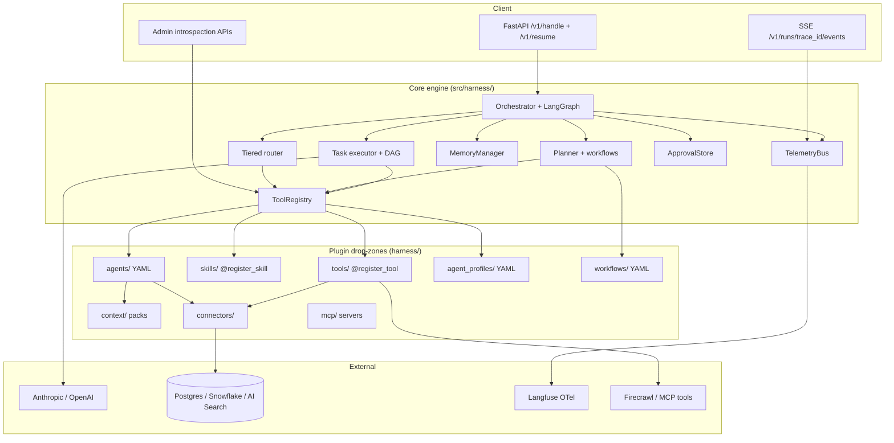

**Rule of thumb:** if it mentions a competitor, advisor, sales metric, or industry term, it belongs in `harness/` config — not in `src/harness/` core.

---

## Repository layout

```
src/harness/                    # Domain-agnostic engine
  api/                          # FastAPI app, lifespan, endpoints
  bootstrap/                    # Discovery, validation, BootstrapState
  agents/                       # DeclarativeAgent, profile loader, stub runner
  config/                       # Config plane loader, secrets resolution
  connectors/                   # Postgres, Snowflake, Azure AI Search factories
  core/                         # Protocols, models, RunContext, request DTOs
  hitl/                         # Approval store, interrupt gate
  llm/                          # Model factory, LLM router
  memory/                       # Working checkpointer, episodic SQLite, artifacts
  orchestrator/                 # Planner, DAG, plan runner, workflows
  registry/                     # ToolRegistry, decorators, data sources
  routing/                      # Capability index, tiered router
  telemetry/                    # OTel spans, event ledger, waterfall

harness/                        # Your business domain (plugins + config)
  tools/                        # @register_tool implementations
  skills/                       # @register_skill compositions
  agents/                       # YAML agent manifests
  agent_profiles/                 # YAML profile overrides (Phase 5)
  workflows/                    # YAML plan templates (Phase 4)
  context/                      # Business glossary, schema docs
  connectors/                   # connector.yaml per data source
  models/                       # LLM endpoint registry
  mcp/                          # MCP server definitions

spec/                           # Phase implementation specs (1–5)
harness.settings.yaml           # Runtime settings
ARCHITECTURE.md                 # This document
```

---

## Bootstrap sequence

At server start (`harness-serve`), `bootstrap()` wires the full runtime:

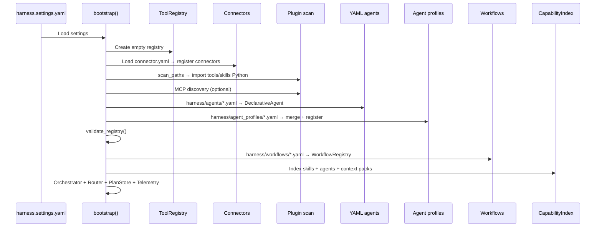

**Order matters:** base agents load before profiles (profiles reference `base_agent`). Tools load before skills (skills declare `required_tools`).

---

## Capability model

Capabilities are the units of routing and planning. They form a hierarchy:

```
Tool          — atomic action (web_search, sql_query, render_output)
  ↑
Skill         — deterministic composition of tools (markdown_to_pdf)
  ↑
Agent         — LLM-driven loop with tools (competitor_research, agentic_analyzer)
  ↑
Profile       — configured instance of a base agent (advisor_deep_dive → agentic_analyzer)
  ↑
Workflow      — multi-step plan template (competitive_sales_brief)
```

### Registry (`ToolRegistry`)

| Registry bucket | Registration | Used by |
|-----------------|--------------|---------|
| `tools` | `@register_tool` decorator | Skills, agents |
| `skills` | `@register_skill` decorator | Router, planner, task executor |
| `agents` | YAML loader + profile loader | Router, planner, task executor |

All capabilities are indexed in `CapabilityIndex` (bag-of-words cosine similarity) for tier-1 retrieval. Optional tier-2 LLM disambiguation when scores are ambiguous.

---

## Request lifecycle

Every request receives a `trace_id` and `thread_id`. All events, spans, and plan snapshots are keyed by `trace_id`.

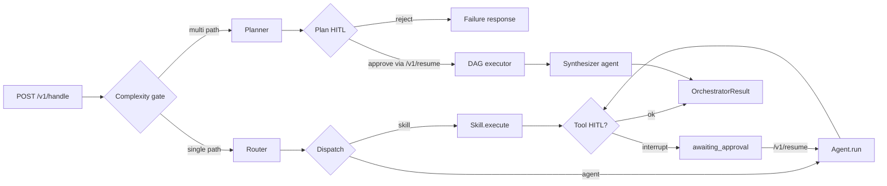

### Request / response DTOs

| Type | Key fields |
|------|------------|
| `IncomingRequest` | `message`, `thread_id`, `skill_input`, `orchestration.mode`, `tool_approvals` |
| `ResumeRequest` | `task_id`, `thread_id`, `decisions[]` |
| `OrchestratorResult` | `status`, `trace_id`, `output`, `plan`, `task_results`, `events`, `interrupts` |

### Status values

| Status | Meaning |
|--------|---------|
| `success` | Completed normally |
| `partial_success` | Multi-agent plan: some tasks failed, synthesizer merged remainder |
| `awaiting_plan_approval` | Plan created; human must approve before tasks run |
| `awaiting_approval` | Agent tool interrupt; human must approve tool invocation |
| `failure` | Unrecoverable error or plan rejected |

---

## Single-agent path

Used when `orchestration.mode` is `single`, or when `auto` mode finds a clear single capability match.

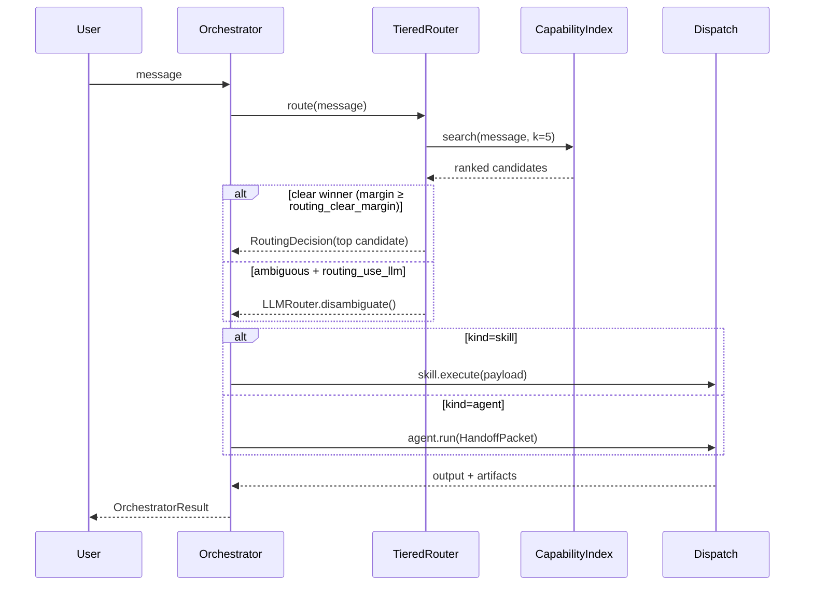

### Routing tiers

1. **Tier 1 — Retrieval:** `CapabilityIndex.search()` scores all skills/agents by token overlap.
2. **Tier 2 — LLM disambiguation:** When top-1 margin is below `routing_clear_margin`, optional `LLMRouter` picks the best candidate (`routing_llm_model` setting).
3. **Fallback:** Default to top retrieval score.

---

## Multi-agent path

Used when `orchestration.mode` is `multi`, or when `auto` detects ambiguous multi-capability routing (two distinct capabilities above threshold with small margin).

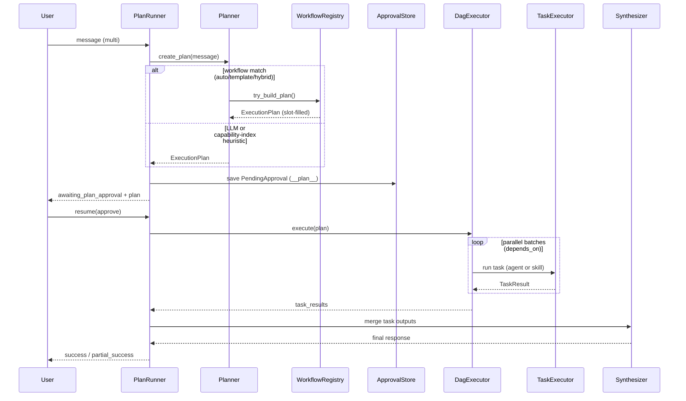

### Complexity gate (`complexity.py`)

| `orchestration_mode` | Behavior |
|----------------------|----------|
| `single` | Never multi-agent |
| `multi` | Always multi-agent |
| `auto` | Multi-agent when top-2 viable capabilities are distinct and routing margin < `routing_clear_margin` |

---

## Planner pipeline

The planner produces an `ExecutionPlan` — a list of `PlannedTask` items with assignees, objectives, dependencies, and optional per-task budgets.

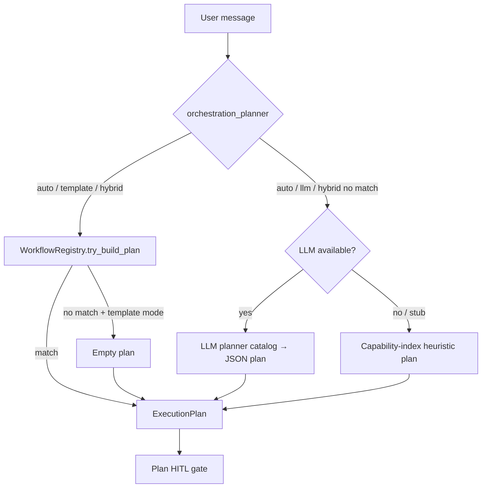

### Planner modes

| Mode | Workflow templates | LLM | Heuristic fallback |
|------|-------------------|-----|-------------------|
| `auto` | Try first | If no match | If no LLM |
| `template` | Only | Never | Empty plan if no match |
| `hybrid` | Try first + LLM objective refinement | On match | If no match |
| `llm` | Skip | Always | If LLM fails |

### Workflow templates (Phase 4)

YAML files in `harness/workflows/` define repeatable plans:

- **Match:** `match_tags` + optional `match_patterns` against user message
- **Slot filling:** regex `variables` → `{{placeholder}}` substitution in task titles/objectives
- **Tasks:** assign to registered agents, skills, or profiles

The synthesizer is **never** in the plan — it is appended automatically after all tasks complete.

### Agent profiles (Phase 5)

Profiles in `harness/agent_profiles/` are **configured instances** of base agents:

```
agentic_analyzer (base)  →  advisor_deep_dive (profile: +max_steps, +config, +prompt fragment)
```

At bootstrap, overrides are validated (tools must be subset of base) and merged into a new manifest registered as a routable agent with `profile_of` set for telemetry.

---

## DAG execution

`DagExecutor` runs plan tasks respecting `depends_on` edges.

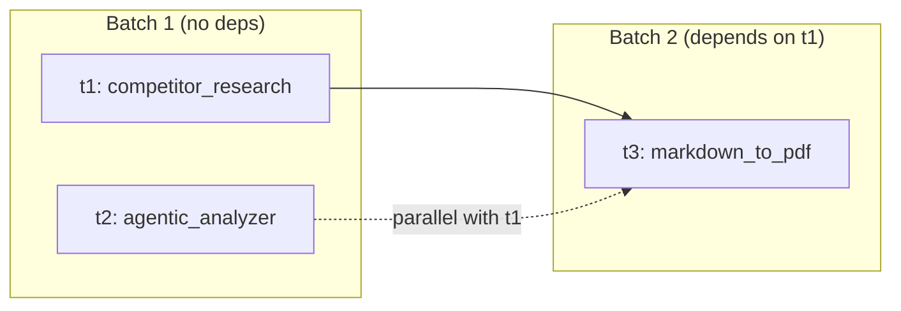

| Setting | Default | Effect |
|---------|---------|--------|
| `orchestration_parallel` | `true` | Run independent tasks concurrently |
| `orchestration_max_parallel` | `3` | Concurrency limit per batch |
| `orchestration_failure_policy` | `continue` | `continue` \| `fail_fast` \| `retry_once` |

Each task emits `TaskEvent` (started / completed / failed) with `duration_ms`. Failed tasks get a user-facing `user_message` via `build_failure_user_message()` using the task's `fallback_hint`.

---

## Human-in-the-loop (HITL)

Two independent approval gates:

### 1. Plan approval (multi-agent)

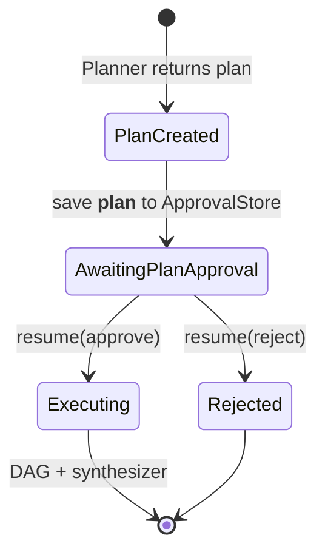

- Sentinel key: `__plan__` in `ApprovalStore`
- `task_id` in the response equals `plan_id`
- Controlled by `orchestration_require_plan_approval` (default `true`)

### 2. Tool approval (per-agent)

Agents declare `interrupt_tools` in their YAML manifest. When the agent invokes an interrupt tool, execution pauses:

- Status: `awaiting_approval`
- Resume via `POST /v1/resume` with `decisions: [{type: approve|edit|reject}]`
- MCP tools default to `requires_approval: true` at bootstrap

---

## Memory architecture

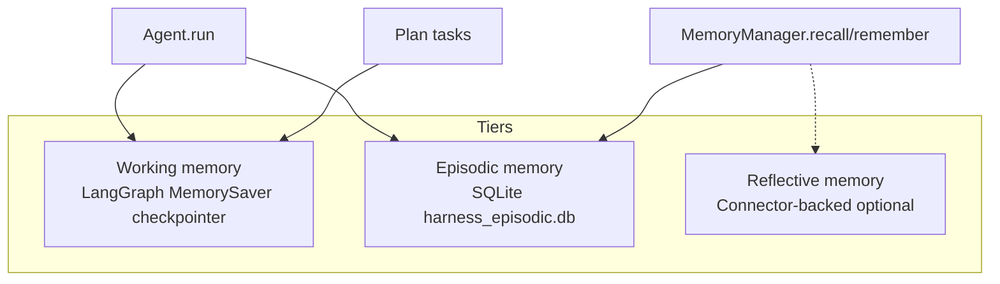

| Tier | Storage | Scope | Purpose |
|------|---------|-------|---------|
| **Working** | In-process `MemorySaver` | Per `thread_id` | Agent conversation state within a run |
| **Episodic** | SQLite | Per namespace tuple | Cross-session recall |
| **Reflective** | Data connector | Org-wide | Curated long-term knowledge (optional) |

Agents receive `memory_namespace` in `HandoffPacket` for scoped recall. Artifact blobs (PDFs, charts) go through `ArtifactStore` and are returned in `OrchestratorResult.artifacts`.

---

## Telemetry and observability

Every operation emits structured events to the `TelemetryBus`:

```mermaid
flowchart LR
  TB[TelemetryBus] --> LEDGER[(Event ledger SQLite)]
  TB --> OTEL[OpenTelemetry spans]
  OTEL --> LF[Langfuse export]

  subgraph Event types
    RT[routing]
    PL[plan]
    TK[task]
    HO[handoff]
    TL[tool]
    LL[llm]
    AT[agent_thought]
    MEM[memory]
  end

  TB --> Event types
```

### Event hierarchy (waterfall)

`GET /admin/plans/{plan_id}/waterfall` builds a parent-child tree from events sharing a `trace_id`:

```
invoke_plan
├── plan (created → approved → completed)
├── execute_plan
│   ├── task:t1 (started → completed)
│   │   └── handoff → tool → llm
│   └── task:t2 (started → failed)
└── synthesizer handoff
```

### Profile telemetry

When a profile agent runs, events include:

- `HandoffEvent.base_agent_name` — the base agent (e.g. `agentic_analyzer`)
- `HandoffEvent.agent_name` — the profile name (e.g. `advisor_deep_dive`)
- Task span attributes: `harness.agent.profile`, `harness.agent.base`

### Realtime streaming

`GET /v1/runs/{trace_id}/events` — Server-Sent Events stream of ledger events for live UI updates.

---

## Persistence

| Store | Default path | Contents |
|-------|--------------|----------|
| Event ledger | `data/harness_events.db` | All telemetry events |
| Episodic memory | `data/harness_episodic.db` | Memory items by namespace |
| HITL approvals | `data/harness_approvals.db` | Pending plan + tool interrupts |
| Plan snapshots | `data/harness_plans.db` | Execution plans, task results, metrics |

Plan store enables post-hoc debugging: `GET /admin/plans`, `GET /admin/plans/{id}`, `GET /admin/metrics`.

Optional webhook alerts (`orchestration_alert_webhook_url`) fire on partial plan failure.

---

## Configuration planes

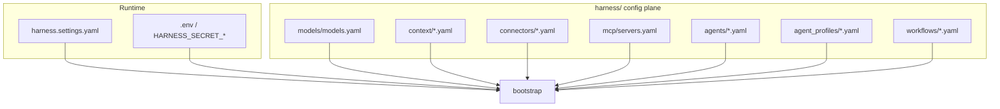

### Key runtime settings

| Setting | Default | Purpose |
|---------|---------|---------|
| `orchestration_mode` | `auto` | `auto` \| `single` \| `multi` |
| `orchestration_planner` | `auto` | Planner mode |
| `orchestration_planner_model` | `fast_router` | LLM for planning |
| `routing_llm_model` | `fast_router` | LLM for routing disambiguation |
| `routing_clear_margin` | `0.15` | Ambiguity threshold |
| `orchestration_require_plan_approval` | `true` | Plan HITL gate |
| `orchestration_synthesizer_agent` | `synthesizer` | Merge agent name |
| `force_stub_models` | `false` | Offline deterministic mode |

Secrets resolve via `${secret:name}` → `HARNESS_SECRET_NAME` environment variables.

---

## Extension points

| Want to add… | Where | How |
|--------------|-------|-----|
| Tool | `harness/tools/` | `@register_tool` class with `ToolSpec` |
| Skill | `harness/skills/` | `@register_skill` class with `SkillManifest` + `infer_input()` |
| Agent | `harness/agents/` | YAML manifest → `DeclarativeAgent` |
| Profile | `harness/agent_profiles/` | YAML with `base_agent` + `overrides` |
| Workflow | `harness/workflows/` | YAML with `match_tags`, `variables`, `tasks` |
| Connector | `harness/connectors/` | `connector.yaml` + factory provider |
| Context | `harness/context/` | YAML pack, wire via `context_packs` on agent |
| MCP server | `harness/mcp/servers.yaml` | stdio/SSE transport config |

Restart `harness-serve` after plugin changes (no hot reload yet).

---

## Orchestration phases

All five phases are implemented. They build on each other:

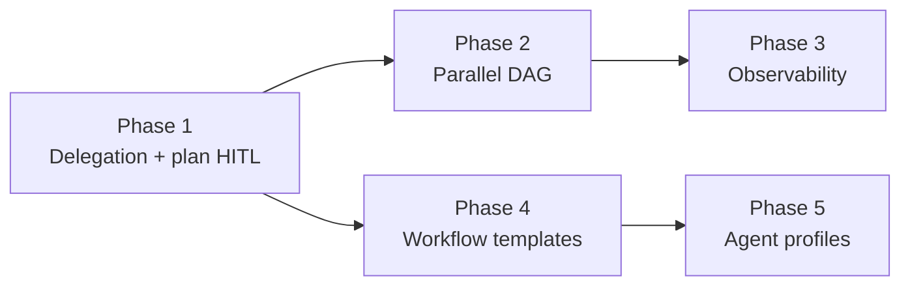

| Phase | Capability | Key modules |
|-------|------------|-------------|
| **1** | Planner, plan HITL, task executor, synthesizer | `planner.py`, `plan_runner.py`, `task_executor.py` |
| **2** | Parallel DAG, `depends_on`, failure policies | `dag_executor.py` |
| **3** | Plan store, waterfall, metrics, alerts | `plan_store.py`, `waterfall.py`, `alerts.py` |
| **4** | YAML workflow templates, slot filling, planner modes | `workflow_*.py` |
| **5** | Agent profile overrides on base agents | `profile_*.py`, `harness/agent_profiles/` |

---

## Data flow example: competitive sales brief

End-to-end flow for a typical multi-agent sales analytics request:

```
1. POST /v1/handle
   message: "Research competitor Acme and analyze advisor Jane Doe sales"
   orchestration.mode: multi

2. Complexity gate → multi-agent (ambiguous: research + analytics capabilities)

3. Planner (auto) → workflow template "competitive_sales_brief" matches
   → variables: competitor=Acme, advisor_name=Jane Doe
   → plan: [t1: competitor_research, t2: agentic_analyzer]

4. Plan HITL → status: awaiting_plan_approval

5. POST /v1/resume { approve }

6. DAG executor → batch 1 runs t1 + t2 in parallel

7. t1: competitor_research agent
   → web_search tool → Firecrawl
   → output: { positioning_summary, competitor }

8. t2: agentic_analyzer agent (or advisor_deep_dive profile)
   → index_lookup → index_fetch_document → flatten → aggregate → render_output
   → output: { analysis_summary, advisor }

9. Synthesizer agent merges t1 + t2 outputs
   → output: { response, completed_tasks, ... }

10. Plan store snapshot + event ledger + Langfuse traces
    → GET /admin/plans/{id}/waterfall for debugging
```

---

## Related documents

| Document | Contents |
|----------|----------|
| [README.md](README.md) | Quick start, API summary |
| [SETUP.md](SETUP.md) | Install, API keys, examples |
| [CONNECTORS.md](CONNECTORS.md) | Data connector configuration |
| [spec/README.md](spec/README.md) | Phase specs with acceptance criteria |
