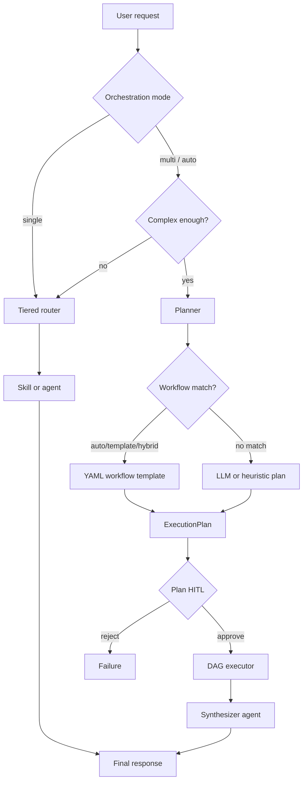

# AI Agent Harness

A **generic, plugin-based agent orchestration harness**. The core engine only knows interfaces — tools, skills, agents, connectors, workflows, and context packs self-register at bootstrap via decorators or YAML manifests. Domain logic lives in config, not in core Python.

> **Architecture deep-dive:** [ARCHITECTURE.md](ARCHITECTURE.md) — layered design, data flows, diagrams, memory, telemetry, and extension points.

## What it does

Given any business context, the harness can:

1. **Route** a user request to the right skill or agent (tiered capability index + optional LLM disambiguation)
2. **Plan** multi-step work when the request spans capabilities (LLM planner, workflow templates, or heuristics)
3. **Pause for HITL** when plans or tools require human approval
4. **Execute** tasks in parallel DAG batches with per-task budgets and failure policies
5. **Synthesize** results into a single response via a dedicated merge agent
6. **Remember** working + episodic memory across runs
7. **Trace** everything — OTel spans, event ledger, plan snapshots, waterfall views

## Request flow

### Single-agent (simple requests)

```
User message
  → Tiered router (capability index)
  → Dispatch skill or agent
  → Response (+ artifacts, events)
```

### Multi-agent (complex / cross-domain requests)

```
User message
  → Complexity gate (orchestration_mode: auto | single | multi)
  → Planner (workflow template | LLM | heuristic fallback)
  → Plan HITL approval (__plan__)
  → DAG executor (parallel batches, depends_on, failure policy)
  → Synthesizer agent (always last)
  → Response (+ plan, task_results, events)
```



## Quick start

See **[SETUP.md](SETUP.md)** for full Windows/macOS/Linux setup, API keys, multi-agent orchestration, HITL, workflows, and extension guides.

```bash
bash scripts/setup_env.sh          # macOS/Linux
# or: .\scripts\setup.ps1          # Windows PowerShell

source .venv/bin/activate          # macOS/Linux
# or: .\.venv\Scripts\Activate.ps1 # Windows

pytest -q
harness-serve
```

## API

| Endpoint | Description |
|----------|-------------|
| `GET /health` | Liveness |
| `GET /admin/capabilities` | Registry + config plane introspection |
| `GET /admin/agent_profiles` | Loaded agent profile templates |
| `GET /admin/workflows` | Loaded workflow templates + planner settings |
| `GET /admin/plans` | Recent execution plans (snapshots) |
| `GET /admin/plans/{plan_id}` | Plan detail + task results |
| `GET /admin/plans/{plan_id}/waterfall` | Event hierarchy for a plan run |
| `GET /admin/metrics` | Plan metrics + registry counts |
| `GET /admin/events` | Event ledger (optionally filter by `trace_id`) |
| `GET /admin/approvals` | Pending HITL approvals |
| `POST /v1/handle` | Route, plan, or dispatch |
| `POST /v1/resume` | Resume after HITL (plan or tool approval) |
| `GET /v1/runs/{trace_id}/events` | SSE stream of run events |

### Examples

**Single skill:**

```bash
curl -X POST http://localhost:8000/v1/handle \
  -H 'Content-Type: application/json' \
  -d '{"message":"Turn my meeting notes into a PDF","skill_input":{"markdown":"# Notes\nHello","title":"Sync"}}'
```

**Multi-agent (plan → HITL → execute):**

```bash
curl -X POST http://localhost:8000/v1/handle \
  -H 'Content-Type: application/json' \
  -d '{"message":"Research competitor Acme Corp and analyze advisor Jane Doe sales.","orchestration":{"mode":"multi"}}'
# → status: awaiting_plan_approval, plan with tasks

curl -X POST http://localhost:8000/v1/resume \
  -H 'Content-Type: application/json' \
  -d '{"task_id":"<plan_id>","thread_id":"<thread_id>","decisions":[{"type":"approve"}]}'
```

## Layout

```
src/harness/              # Core library (domain-agnostic)
  agents/                 # DeclarativeAgent (YAML → deepagents)
  analytics/              # Shared analytics helpers (used by tools)
  config/                 # YAML config plane loader
  memory/                 # MemoryManager + artifacts
  routing/                # Capability index + tiered router
  orchestrator/           # LangGraph dispatch, planner, DAG executor, workflows
  telemetry/              # OTel spans, event ledger, waterfall
harness/                  # Plugin + config drop-zones (your domain)
  tools/                  # @register_tool
  skills/                 # @register_skill
  agents/                 # YAML agent manifests
  workflows/              # YAML multi-agent plan templates (Phase 4)
  agent_profiles/         # YAML agent profile overrides (Phase 5)
  connectors/             # connector.yaml per data source
  context/                # Business context packs
  models/                 # LLM endpoint registry
  mcp/                    # MCP server registry
spec/                     # Orchestration phase specs (1–5)
harness.settings.yaml
```

## Orchestration phases

| Phase | Feature | Status |
|-------|---------|--------|
| 1 | Multi-agent delegation — planner, plan HITL, task executor, synthesizer | **Implemented** |
| 2 | Parallel DAG — `depends_on`, concurrency limits, failure policies | **Implemented** |
| 3 | Observability — plan store, waterfall, metrics, alerts | **Implemented** |
| 4 | Workflow templates — YAML plans, slot filling, planner modes | **Implemented** |
| 5 | Dynamic sub-agent profiles — runtime YAML overrides on base agents | **Implemented** |

See **[spec/README.md](spec/README.md)** for detailed specs.

## Core platform (earlier phases)

- **Registries** — tools, skills, agents, connectors self-register at import
- **Config plane** — YAML models, context packs, MCP servers, secrets
- **Tiered routing** — capability index with optional LLM disambiguation
- **Memory** — working (checkpointer) + episodic SQLite stores
- **HITL** — tool interrupts + mandatory plan approval for multi-step runs
- **Telemetry** — OTel GenAI spans, event ledger, Langfuse export
- **MCP** — external tool servers discovered at bootstrap

## Planner modes

Configured via `orchestration_planner` in `harness.settings.yaml`:

| Setting | Default | Purpose |
|---------|---------|---------|
| `orchestration_planner_model` | `fast_router` | LLM for planning / hybrid refinement |
| `routing_llm_model` | `fast_router` | LLM for routing disambiguation |

| Mode | Behavior |
|------|----------|
| `auto` | Try workflow template match first, then LLM/heuristic |
| `template` | Workflow templates only |
| `hybrid` | Template structure + LLM-refined objectives |
| `llm` | Skip templates; LLM plans from capability catalog |

## Related project

Qwen agentic fine-tuning lives on a separate branch (`cursor/qwen-agentic-ft-setup-7e0b`) — not part of this harness codebase.

## Data connectors

See **[CONNECTORS.md](CONNECTORS.md)** for Postgres, Snowflake, Azure AI Search, and MCP configuration.
