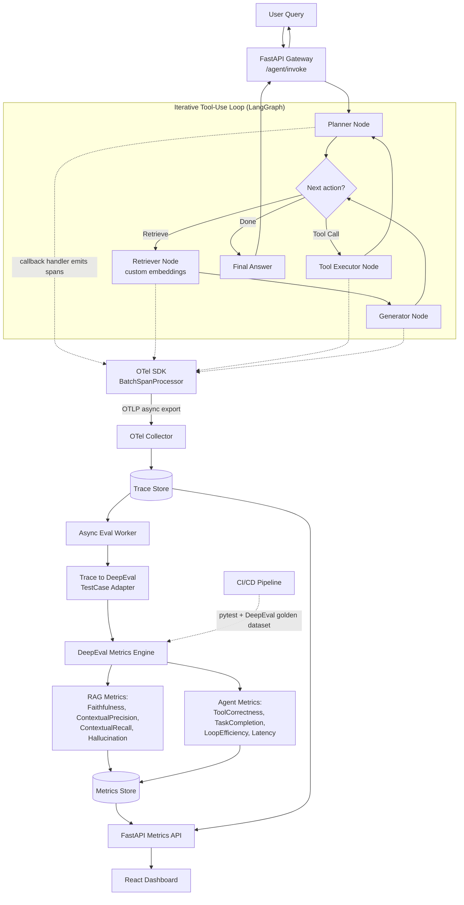

# Agentic RAG Evaluation Harness — Architecture & Implementation Plan

## 1. Conceptual Architecture: How the Three Pieces Interact

| Layer | Role | Lives in the hot path? |
|---|---|---|
| **LangGraph / LangChain** | Runtime. Defines and executes the agent's control flow (state graph: planner → decide → retrieve/tool → generate → loop), owns working memory/state. | Yes — this *is* the request. |
| **OpenTelemetry** | Nervous system. Cross-cutting instrumentation wrapping every node, tool call, and LLM call as a span. Captures latency, token usage, tool args/results, retrieved docs, decision rationale. Exports asynchronously. | Span *creation* yes (cheap, in-memory), span *export* no (background thread). |
| **DeepEval** | Judge. Consumes structured test cases reconstructed from completed traces (or a golden dataset in CI) and runs metrics (GEval, Faithfulness, ContextualPrecision/Recall, ToolCorrectness, TaskCompletion, custom LoopEfficiency). | **Never.** Always async/offline, off the request thread. |

The critical design decision is decoupling the **hot path** (user query → agent execution → response) from the **cold path** (trace → eval → dashboard). OTel spans are emitted synchronously into a lightweight buffer during execution, but exporting and scoring happen out-of-band. DeepEval's LLM-as-judge metrics are the expensive part (extra LLM calls per metric) — keeping them entirely outside the response loop is what makes this production-viable rather than a notebook demo.

## 2. Architecture Diagram



## 3. Telemetry → Evaluation Pipeline (Non-Blocking Design)

**Instrumentation.** Bridge LangChain's `BaseCallbackHandler` (or LangGraph's native tracing hooks) into OTel spans — one span per node execution, tagged with `gen_ai.*` semantic-convention attributes: input/output, token counts, tool name/args, retrieved doc IDs + similarity scores. This bridge is the *only* place LangGraph and OTel touch each other.

**Async export.** Use `BatchSpanProcessor`, never `SimpleSpanProcessor` — spans are created cheaply in-request and flushed on a background thread. Export via OTLP/gRPC to a local OTel Collector sidecar.

**Fan-out.** The Collector routes spans to (a) a trace store (Postgres to start, Clickhouse/Tempo if volume grows), and (b) optionally a queue (Redis Streams/Kafka) that signals "trace completed" when the root span closes.

**Async eval worker.** A separate process — `FastAPI BackgroundTasks` for dev, a real Celery/Redis (or queue-consumer) worker for prod — picks up completed traces and reconstructs a DeepEval `LLMTestCase`:
- `input` = original user query
- `actual_output` = final agent answer
- `retrieval_context` = docs pulled from the Retriever Node's span attributes
- `tools_called` / `expected_tools` = from Tool Executor spans

Metrics run against this reconstructed test case, and results are written to the Metrics Store keyed by `trace_id` — completely decoupled from the live response.

**Sampling.** Because LLM-judge metrics cost real money/latency per trace, apply head-based sampling at the SDK (100% in dev, 10–20% in high-volume prod) or tail-based sampling in the Collector (always keep error traces, sample the rest). This is what keeps eval cost sub-linear with traffic.

**CI/CD path (separate from live traces).** A curated `golden_dataset` (query, expected answer, expected context, expected tool sequence) runs through DeepEval as pytest assertions (`assert_test` / `deepeval test run`) as a pre-merge regression gate — independent of the production trace flow.

## 4. Directory Structure

### `/backend`

```
backend/
├── app/
│   ├── main.py                     # FastAPI entrypoint, OTel SDK init
│   ├── api/v1/
│   │   ├── agent_routes.py         # POST /agent/invoke, /agent/stream
│   │   ├── trace_routes.py         # GET /traces, /traces/{id}
│   │   ├── metrics_routes.py       # GET /metrics/rag, /metrics/agent
│   │   └── eval_routes.py          # POST /eval/run (manual/CI trigger)
│   ├── core/
│   │   ├── config.py               # Pydantic Settings
│   │   ├── telemetry.py            # TracerProvider, exporters, resource attrs
│   │   └── logging.py
│   ├── agent/
│   │   ├── graph.py                # LangGraph StateGraph definition
│   │   ├── state.py                # AgentState schema
│   │   ├── nodes/
│   │   │   ├── planner.py
│   │   │   ├── retriever.py
│   │   │   ├── tool_executor.py
│   │   │   └── generator.py
│   │   └── tools/
│   │       ├── registry.py
│   │       └── custom_tools.py
│   ├── rag/
│   │   ├── embeddings.py           # custom embedding model wrapper
│   │   ├── vectorstore.py
│   │   └── retriever.py
│   ├── telemetry/
│   │   ├── callback_bridge.py      # LangChain callback -> OTel span bridge
│   │   ├── semantic_conventions.py # gen_ai.* attribute helpers
│   │   └── trace_adapter.py        # completed trace -> DeepEval TestCase
│   ├── evaluation/
│   │   ├── metrics/
│   │   │   ├── rag_metrics.py
│   │   │   └── agent_metrics.py    # custom GEval / DAG metrics
│   │   ├── runners/
│   │   │   ├── realtime_worker.py  # async consumer, scores completed traces
│   │   │   └── ci_runner.py        # pytest + assert_test entrypoints
│   │   └── datasets/
│   │       └── golden_dataset.py
│   ├── db/
│   │   ├── models.py               # Trace, Span, EvalResult (SQLAlchemy)
│   │   ├── session.py
│   │   └── migrations/             # Alembic
│   └── schemas/
│       ├── agent.py
│       ├── trace.py
│       └── metrics.py
├── tests/
│   ├── unit/
│   └── eval/                       # deepeval test_*.py files, run via CI
├── pyproject.toml
├── Dockerfile
└── alembic.ini
```

### `/frontend`

```
frontend/
├── src/
│   ├── components/
│   │   ├── dashboard/
│   │   │   ├── MetricsOverview.tsx
│   │   │   ├── AgentLoopChart.tsx
│   │   │   └── RagMetricsPanel.tsx
│   │   ├── traces/
│   │   │   ├── TraceList.tsx
│   │   │   ├── TraceTimeline.tsx
│   │   │   └── SpanDetail.tsx
│   │   └── shared/
│   │       ├── Card.tsx
│   │       ├── Badge.tsx
│   │       └── ScoreBar.tsx
│   ├── pages/
│   │   ├── Dashboard.tsx
│   │   ├── Traces.tsx
│   │   ├── TraceDetail.tsx
│   │   └── Evaluations.tsx
│   ├── hooks/
│   │   ├── useTraces.ts
│   │   └── useMetrics.ts
│   ├── api/
│   │   ├── client.ts
│   │   ├── traces.ts
│   │   └── metrics.ts
│   ├── types/
│   │   ├── trace.ts
│   │   └── metrics.ts
│   ├── lib/utils.ts
│   ├── App.tsx
│   └── main.tsx
├── tailwind.config.ts
├── package.json
└── vite.config.ts
```

### Root

```
/
├── backend/
├── frontend/
├── infra/
│   ├── docker-compose.yml        # postgres, otel-collector, backend, frontend
│   └── otel-collector-config.yaml
└── README.md
```

## 5. MVP Roadmap

| Phase | Focus | Why this order |
|---|---|---|
| 0 | Repo & infra scaffolding | Get containers booting before any logic exists |
| 1 | Basic RAG eval (offline, single-shot chain) | Prove DeepEval + golden dataset works before adding tracing complexity |
| 2 | Real-time OTel trace capture | Add observability to the *simple* chain first, not the agent loop |
| 3 | Async eval pipeline | Wire traces → DeepEval scoring off the hot path, still on the simple chain |
| 4 | LangGraph agent loop migration | Now introduce the iterative tool-use loop, with tracing already proven |
| 5 | Agent metrics | ToolCorrectness, TaskCompletion, LoopEfficiency on top of the working loop |
| 6 | Production hardening | Sampling, alerting, auth, storage scaling, load testing |

## 6. Task-by-Task Breakdown for Agentic Implementation

Each task is scoped to be handed to a coding agent independently, with a clear Definition of Done.

### Phase 0 — Repo & Infra Scaffolding
- **P0-T1**: Init monorepo (`/backend`, `/frontend`, `/infra`), root README, `.gitignore`.
- **P0-T2**: Backend skeleton — FastAPI app, Pydantic `Settings`, `/health` route, Dockerfile. *DoD: `uvicorn` boots, `/health` returns 200.*
- **P0-T3**: Frontend skeleton — Vite + React + TS + Tailwind + Lucide, basic layout shell. *DoD: `npm run dev` renders an empty shell.*
- **P0-T4**: `docker-compose.yml` with Postgres + OTel Collector (no pipelines wired yet). *DoD: all containers healthy via `docker compose up`.*

### Phase 1 — Basic RAG Evaluation (offline, no agent loop)
- **P1-T1**: Custom embeddings wrapper + vector store (`rag/embeddings.py`, `vectorstore.py`).
- **P1-T2**: Single-shot retrieve→generate chain via LangChain (no loop yet).
- **P1-T3**: `golden_dataset.py` — 15–20 curated query/answer/expected-context examples.
- **P1-T4**: DeepEval pytest suite (`tests/eval/test_rag_metrics.py`) — Faithfulness, ContextualPrecision, ContextualRecall, Hallucination against the golden dataset.
- **P1-T5**: `ci_runner.py` + GitHub Actions workflow running `deepeval test run` on PRs.
- **P1-T6**: `/eval/run` endpoint — trigger the RAG suite manually, return a JSON scorecard.
- **P1-T7**: Minimal `Evaluations.tsx` rendering the JSON scorecard as a table. *DoD: full loop from `npm run dev` → hit endpoint → see scores in browser.*

### Phase 2 — OTel Trace Capture (real-time, single-shot chain)
- **P2-T1**: `telemetry.py` — TracerProvider, Resource attrs, `BatchSpanProcessor` + OTLP exporter.
- **P2-T2**: `callback_bridge.py` — LangChain callback handler opening/closing OTel spans per chain/tool/retriever step with `gen_ai.*` attributes.
- **P2-T3**: Attach the handler to the Phase-1 chain; verify spans land in the Collector/trace store.
- **P2-T4**: `db/models.py` `Trace`/`Span` tables; persist spans from the Collector (or a small consumer) into Postgres.
- **P2-T5**: `trace_routes.py` — `GET /traces`, `GET /traces/{id}`.
- **P2-T6**: `TraceList.tsx` + `TraceTimeline.tsx` — basic trace viewer UI. *DoD: a live query is visible end-to-end as a trace in the UI.*

### Phase 3 — Async Eval Pipeline (traces → DeepEval, off the hot path)
- **P3-T1**: `trace_adapter.py` — reconstruct an `LLMTestCase` from a completed trace's spans.
- **P3-T2**: `realtime_worker.py` — background consumer (BackgroundTasks in dev / Celery+Redis in prod) scoring newly completed traces with `rag_metrics.py`.
- **P3-T3**: `EvalResult` table; persist scores + reasoning keyed by `trace_id`.
- **P3-T4**: `metrics_routes.py` — `GET /metrics/rag` (aggregated + per-trace).
- **P3-T5**: `MetricsOverview.tsx` + `RagMetricsPanel.tsx` — dashboard shows live, trace-linked scores.
- **P3-T6**: Sampling config (env-driven eval rate) to bound LLM-judge cost. *DoD: send a request, watch its trace get scored asynchronously without the response waiting on eval.*

### Phase 4 — Agent Loop / LangGraph Migration
- **P4-T1**: `AgentState` + `StateGraph` in `agent/graph.py` (Planner → Decide → Retrieve/Tool → Generate → loop).
- **P4-T2**: `nodes/planner.py`, `tool_executor.py` + a small tool registry.
- **P4-T3**: Extend `callback_bridge.py`/LangGraph tracing hooks to tag `loop_index`, `tool_name`, `tool_args/result`, `decision_rationale`.
- **P4-T4**: Swap `/agent/invoke` to call the LangGraph app instead of the Phase-1 chain.
- **P4-T5**: Extend `TraceTimeline.tsx` to render loop iterations and tool spans distinctly (Lucide icons). *DoD: a multi-turn tool-use trace renders as a readable timeline, not a flat list.*

### Phase 5 — Agent Metrics
- **P5-T1**: `agent_metrics.py` — `ToolCorrectness`, `TaskCompletion`, and a custom `LoopEfficiency` GEval metric (penalize iterations beyond an expected/optimal count).
- **P5-T2**: Extend `trace_adapter.py` to build `tools_called`/`expected_tools` and turn-by-turn context for agent test cases.
- **P5-T3**: Extend `golden_dataset.py` with agent-loop scenarios (expected tool sequence, expected max loop count).
- **P5-T4**: Extend `realtime_worker.py` to run agent metrics alongside RAG metrics for agent-produced traces.
- **P5-T5**: `AgentLoopChart.tsx` — loop count, tool accuracy, task success rate over time. *DoD: dashboard distinguishes "efficient" vs. "looping/thrashing" agent runs.*

### Phase 6 — Production Hardening
- **P6-T1**: Tail-based sampling policy in the Collector (always keep error traces, sample the rest).
- **P6-T2**: Alerting — threshold checks on aggregated scores (e.g., faithfulness < 0.7) posting to Slack/webhook.
- **P6-T3**: Auth on API routes (API key/OAuth), row-level scoping if multi-tenant.
- **P6-T4**: Swap Postgres trace store for Clickhouse/Tempo if volume requires it; add retention policy.
- **P6-T5**: Load test `/agent/invoke` to confirm the eval pipeline adds ~0 latency to the live response.
- **P6-T6**: Documentation + on-call runbook (reading a regression, re-running CI eval).
