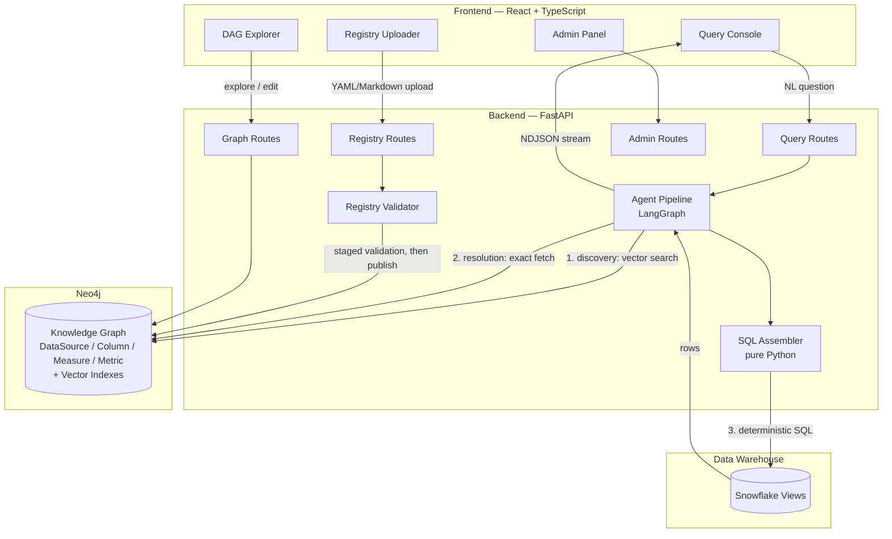
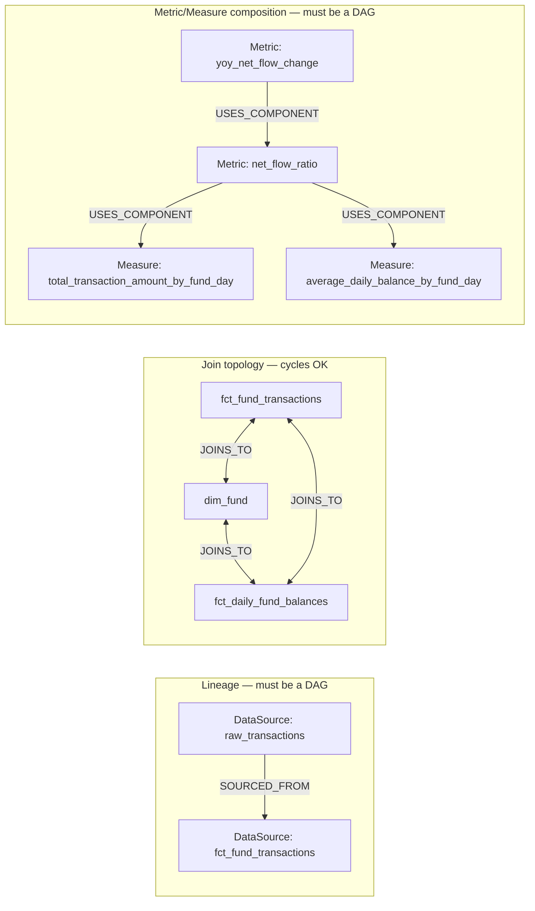
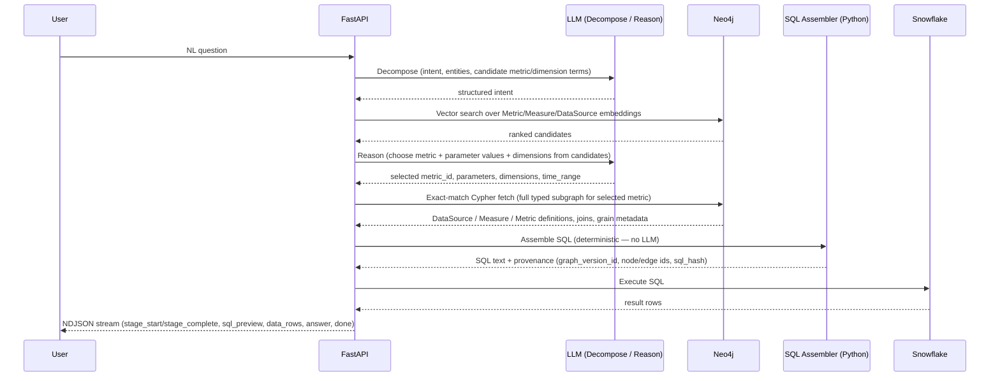
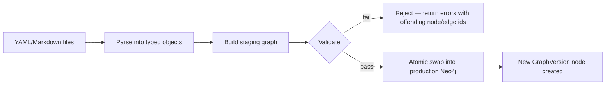

# Semantic Layer Shell — Architecture
### Pilot: Intelligence Hub

**Status:** Phase 2 implemented (branch `cursor/semantic-layer-shell`)
**Owner:** Shobhit Tiwari
**Purpose:** A platform-agnostic semantic layer, backed by a Neo4j knowledge graph, that lets AI agents generate deterministic, idempotent SQL against a warehouse (initially Snowflake) without hardcoding to specific views. Business context, metric definitions, and join paths are supplied as data (YAML/Markdown), not code, so the platform is domain-agnostic — this document uses fund/transaction examples for concreteness, but the schema imposes no domain assumptions.

**Related docs:** [Setup guide](setup.md) · [Project README](../README.md)

---

## Implementation status

### Phase 1 — complete

Registry, Neo4j bootstrap, LLM pipeline, deterministic SQL assembly, Snowflake execution, audit log, graph versioning/rollback, header-based RBAC.

### Phase 2 — complete

| Area | Status | Notes |
|---|---|---|
| Extended pipeline stages | Done | analyze → insights → visualization → explorer → answer |
| Query result cache | Done | Keyed by graph version + node/edge set + sql_hash |
| Revision hints | Done | `revision_hint` on query API re-runs reason step |
| Entity `REPRESENTS` edges | Done | `entity_ref` on columns → Entity nodes |
| `latest_snapshot` join strategy | Done | Snapshot CTEs prepended in SQL assembler |
| Dimensional join validation | Done | Join keys validated per source/target column |
| Visual DAG (React Flow) | Done | `@xyflow/react` in DAG Explorer |
| SSO / OAuth | Skipped | Header-based `X-User-Role` is sufficient for pilot |

### Phase 3 — planned

Multi-warehouse, row-level security, schema-introspection-assisted YAML authoring.

---

## Table of Contents

1. [Design Principles](#1-design-principles)
2. [System Architecture](#2-system-architecture)
3. [Metadata Registry — YAML Schema](#3-metadata-registry--yaml-schema)
4. [Neo4j Graph Schema](#4-neo4j-graph-schema)
5. [Agent Data Flow](#5-agent-data-flow)
6. [Graph Validation Strategy](#6-graph-validation-strategy)
7. [Backend Architecture (FastAPI)](#7-backend-architecture-fastapi)
8. [REST API Specification](#8-rest-api-specification)
9. [Frontend Architecture (React)](#9-frontend-architecture-react)
10. [Access Control (RBAC)](#10-access-control-rbac)
11. [Versioning, Auditability & Observability](#11-versioning-auditability--observability)
12. [Phased Roadmap](#12-phased-roadmap)
13. [Open Risks](#13-open-risks)

---

## 1. Design Principles

These are the non-negotiables — every design decision below traces back to one of these.

1. **Assembly, not generation.** An LLM never authors a JOIN condition, a `GROUP BY`, or an aggregation expression. It selects from an enumerated set of graph-defined options (which metric, which parameter value, which dimensions). SQL is *assembled* from literal fragments stored in the graph by deterministic Python code.
2. **Three graphs, one store, different rules.** The Neo4j instance holds three logically distinct subgraphs sharing nodes:
   - **Lineage** (`SOURCED_FROM`) — must be acyclic.
   - **Join topology** (`JOINS_TO`) — cycles are normal and expected (star/snowflake join patterns).
   - **Composition** (`USES_COMPONENT`, Metric→Measure/Metric) — must be acyclic.
   Validation logic must never conflate these.
3. **Discovery is separate from resolution.** Semantic (embedding) search narrows *candidates*. Once a candidate is chosen, retrieving its full definition is an exact-match graph lookup, not another similarity search. This is what keeps repeated questions idempotent.
4. **Grain is a first-class property, not a comment.** Every `DataSource` and `Measure` declares its grain explicitly. Joining two facts at different grains without a declared pre-aggregation step is a validation error, not a runtime surprise.
5. **Domain-agnostic core, pluggable registry.** The backend and graph schema carry no domain vocabulary. All business meaning lives in YAML/Markdown files ingested into the graph.
6. **Every answer is auditable.** Every generated SQL statement is traceable to a specific graph version and the exact set of node/edge IDs used to build it.

---

## 2. System Architecture



**Component responsibilities**

| Component | Responsibility | Determinism guarantee |
|---|---|---|
| Neo4j | System of record for the registry; vector-indexed discovery; DAG storage for the visualization UI | N/A — data layer |
| Registry Validator | Parses YAML/Markdown, runs DAG/grain/canonical-path checks, stages before publish | Rejects anything that would make downstream SQL non-deterministic |
| Agent Pipeline (LangGraph) | Orchestrates decompose → reason → resolve → assemble → execute → answer | LLM only in decompose/reason/answer stages |
| SQL Assembler | Pure Python; hydrates a resolved subgraph into a SQL string | No LLM involvement — same inputs always produce the same SQL text |
| Snowflake | Executes assembled SQL | Standard warehouse guarantees |

---

## 3. Metadata Registry — YAML Schema

Developers author these files under typed folders in `registry/` (or upload via the UI); the backend parses and ingests them to **bootstrap Neo4j** on startup or via `python -m scripts.bootstrap_graph`. The registry has four **kinds**. Field names are domain-neutral — the examples below use asset-management data purely for illustration.

```
registry/
  data_sources/    # kind: data_source
  measures/        # kind: measure  — depends_on → data_source
  metrics/         # kind: metric   — components + depends_on → measures
  entities/        # kind: entity   — business glossary (sample in Phase 1)
```

**Dependency model:** Measures declare `depends_on` data sources. Metrics declare `components` (for `USES_COMPONENT` edges) and should declare matching `depends_on` entries for explicit lineage. If `depends_on` is omitted on a metric, it is derived from `components` at validation time.

### 3.1 `data_source` — a physical view/table

```yaml
apiVersion: semantic-layer/v1
kind: data_source
metadata:
  id: fct_fund_transactions          # [REQUIRED] snake_case, matches filename
  name: "Fund Transactions Fact"
  description: |
    One row per transaction. Grain: transaction_id.
  owner: data-eng-team
  status: active                     # draft | active | deprecated

spec:
  type: fact                         # fact | dimension | bridge
  location: analytics.marts.fct_fund_transactions
  grain: "one row per transaction_id"
  grain_keys: [transaction_id]

  schema_fields:                     # every column, whether exposed or not
    - name: transaction_id
      type: string
      role: key                      # key | entity | dimension | amount | filter | timestamp | time_key | metadata
      exposed: true
    - name: fund_id
      type: string
      role: entity
      exposed: true
    - name: transaction_date
      type: date
      role: time_key
      exposed: true
    - name: transaction_amount
      type: decimal
      role: amount
      exposed: true
    - name: is_test_account
      type: boolean
      role: filter
      exposed: false                 # available for filtering, never returned to callers
    - name: internal_notes
      type: string
      role: metadata
      exposed: false
      pii: false

  joins:
    - target: dim_fund
      on: "fund_id = fund_id"
      cardinality: many-to-one
      type: left
      canonical: true                 # exactly one canonical edge per (source, target) pair
      strategy: full_history           # full_history | latest_snapshot
      notes: "Standard conformed dimension join."

    - target: fct_daily_fund_balances
      on: "fund_id = fund_id, transaction_date = snapshot_date"
      cardinality: many-to-many
      type: inner
      canonical: true
      requires_preaggregation: [self, target]   # fact-to-fact — both sides must roll up first
      notes: "See measures using aggregate_via for the required rollups."
```

### 3.2 `measure` — a parameterized, aggregable SQL fragment

```yaml
apiVersion: semantic-layer/v1
kind: measure
metadata:
  id: total_transaction_amount_by_fund_day
  name: "Total Transaction Amount (by Fund, Day)"
  description: "Rolls transaction-grain data up to fund + day grain."

spec:
  parameters:
    basis:
      default: gross
      options:
        gross:
          column: transaction_amount
          description: "Gross transaction amount"
        net:
          column: net_transaction_amount
          description: "Net of fees"

  time_filter:
    type: direct                     # direct | decomposed
    column: transaction_date
    alias: t

  dimension_context:
    alias: t                         # table alias the assembler injects GROUP BY dimensions against

  sql_fragment: |
    SELECT
      fund_id,
      transaction_date,
      SUM({{basis.column}}) AS total_amount
    FROM analytics.marts.fct_fund_transactions t
    WHERE is_test_account = false
    GROUP BY ALL

  output_columns:
    - name: fund_id
      type: string
      role: dimension
    - name: transaction_date
      type: date
      role: time_key
    - name: total_amount
      type: decimal
      role: value

  depends_on:
    - kind: data_source
      ref: fct_fund_transactions
```

### 3.3 `metric` — a composition of measures (and/or other metrics)

```yaml
apiVersion: semantic-layer/v1
kind: metric
metadata:
  id: net_flow_ratio
  name: "Net Flow Ratio"
  description: "Net transaction flow as a percentage of average daily balance."
  owner: product-analytics
  status: active
  tags: [flows, fund-performance]

spec:
  metric_type: ratio                 # simple | ratio | change | composite

  components:
    numerator:
      kind: measure
      ref: total_transaction_amount_by_fund_day
      parameters:
        basis: net
    denominator:
      kind: measure
      ref: average_daily_balance_by_fund_day

  formula: "numerator.total_amount / denominator.avg_balance"

  unit: percentage
  direction: higher_is_better         # higher_is_better | lower_is_better | target_range

  dimensions: [fund_id, share_class]
  time_key: transaction_date

  business_rules:
    - "Excludes test/internal accounts."
    - "Ratio is null when the denominator balance is zero."

  depends_on:
    - kind: measure
      ref: total_transaction_amount_by_fund_day
    - kind: measure
      ref: average_daily_balance_by_fund_day
```

> **Note:** `depends_on` lists the measures this metric relies on. It must align with `components` refs. Composition edges (`USES_COMPONENT`) come from `components`; `depends_on` provides explicit lineage for validation and audit.

### 3.4 `entity` — business-glossary layer

```yaml
apiVersion: semantic-layer/v1
kind: entity
metadata:
  id: fund
  name: "Fund"
  description: "A single investment vehicle."
  synonyms: [product, portfolio]

spec: {}
```

See `registry/entities/fund.yaml` for the pilot sample. Full `REPRESENTS` edges from columns to entities are Phase 2.

---

## 4. Neo4j Graph Schema

### 4.1 Nodes

| Label | Key properties | Notes |
|---|---|---|
| `:DataSource` | `id`, `name`, `description`, `description_embedding`, `owner`, `status`, `type` (fact/dimension/bridge), `location`, `grain`, `grain_keys[]` | One per YAML `data_source` |
| `:Column` | `name`, `type`, `role`, `exposed`, `pii`, `description` | Modeled as its own node (not a JSON blob) so role/PII can be queried directly; parent via `HAS_COLUMN` |
| `:Measure` | `id`, `name`, `description`, `description_embedding`, `parameters` (JSON), `time_filter` (JSON), `dimension_context` (JSON), `sql_fragment`, `output_columns` (JSON), `owner`, `status` | One per YAML `measure` |
| `:Metric` | `id`, `name`, `description`, `description_embedding`, `metric_type`, `formula`, `unit`, `direction`, `dimensions[]`, `time_key`, `business_rules[]`, `owner`, `status`, `tags[]` | One per YAML `metric` |
| `:Entity` | `id`, `name`, `definition`, `definition_embedding`, `synonyms[]` | Phase 2 |
| `:GraphVersion` | `id`, `created_at`, `source_ref`, `published_by` | One per successful publish (blue-green swap) |

### 4.2 Relationships

| Relationship | Direction | Key properties | Subgraph | Cyclicity |
|---|---|---|---|---|
| `HAS_COLUMN` | `DataSource → Column` | — | structural | n/a |
| `SOURCED_FROM` | `DataSource → DataSource` | — | **Lineage** | must be acyclic |
| `JOINS_TO` | `DataSource → DataSource` | `on`, `type`, `cardinality`, `canonical`, `strategy`, `pre_filter`, `requires_preaggregation` | **Join topology** | cycles allowed |
| `DEPENDS_ON` | `Measure → DataSource` | — | structural | n/a |
| `USES_COMPONENT` | `Metric → Measure` or `Metric → Metric` | `role` (e.g. `numerator`), `parameters` (JSON, forwarded) | **Composition** | must be acyclic |
| `REPRESENTS` | `Column → Entity` | — | glossary (Phase 2) | n/a |
| `VERSION_OF` | `(DataSource\|Measure\|Metric) → GraphVersion` | — | structural | n/a |

### 4.3 The three subgraphs, visually



### 4.4 Constraints and indexes

```cypher
CREATE CONSTRAINT data_source_id IF NOT EXISTS FOR (d:DataSource) REQUIRE d.id IS UNIQUE;
CREATE CONSTRAINT measure_id      IF NOT EXISTS FOR (m:Measure)    REQUIRE m.id IS UNIQUE;
CREATE CONSTRAINT metric_id       IF NOT EXISTS FOR (m:Metric)     REQUIRE m.id IS UNIQUE;
CREATE CONSTRAINT entity_id       IF NOT EXISTS FOR (e:Entity)     REQUIRE e.id IS UNIQUE;
CREATE CONSTRAINT graph_version_id IF NOT EXISTS FOR (v:GraphVersion) REQUIRE v.id IS UNIQUE;

CREATE VECTOR INDEX metric_desc_embedding IF NOT EXISTS
FOR (m:Metric) ON (m.description_embedding)
OPTIONS {indexConfig: {`vector.dimensions`: 1536, `vector.similarity_function`: 'cosine'}};

CREATE VECTOR INDEX measure_desc_embedding IF NOT EXISTS
FOR (m:Measure) ON (m.description_embedding)
OPTIONS {indexConfig: {`vector.dimensions`: 1536, `vector.similarity_function`: 'cosine'}};

CREATE VECTOR INDEX datasource_desc_embedding IF NOT EXISTS
FOR (d:DataSource) ON (d.description_embedding)
OPTIONS {indexConfig: {`vector.dimensions`: 1536, `vector.similarity_function`: 'cosine'}};
```

---

## 5. Agent Data Flow



**Stage-by-stage determinism guarantee**

| Stage | Tool | LLM involved? | Determinism guarantee |
|---|---|---|---|
| Decompose | LLM | Yes | Non-deterministic input parsing — this is expected and fine; it only proposes candidates |
| Discover (vector search) | Neo4j | No | Same query text + same graph version → same candidate ranking |
| Reason (select) | LLM | Yes | Constrained to the enumerated candidate list — cannot invent a metric that doesn't exist |
| Resolve (exact fetch) | Neo4j | No | Exact ID lookup — no ambiguity |
| Assemble | Python | **No** | Same resolved node/edge set → byte-identical SQL, always |
| Execute | Snowflake | No | Standard warehouse determinism |
| Analyze / Answer | LLM (Phase 2) | Yes | Narrative only — never alters the executed SQL or the returned rows |

Phase 1 scope stops at `answer`; the statistical-analysis/insights/visualization/revision/explorer stages (see [§12](#12-phased-roadmap)) are deferred until this core loop is validated.

---

## 6. Graph Validation Strategy

Ingestion is staged, never applied directly to the production graph.



**Validation checks, in order:**

1. **Schema validation** — every YAML matches its `kind`'s required fields.
2. **Reference integrity** — every `depends_on`, `components.*.ref`, and `joins.target` resolves to an existing (or co-uploaded) node.
3. **Lineage acyclicity** (`SOURCED_FROM` subgraph):
   ```cypher
   MATCH p = (d:DataSource)-[:SOURCED_FROM*1..]->(d)
   RETURN d.id AS cyclic_node, [n IN nodes(p) | n.id] AS cycle_path;
   ```
4. **Composition acyclicity** (`USES_COMPONENT` subgraph):
   ```cypher
   MATCH p = (m:Metric)-[:USES_COMPONENT*1..]->(m)
   RETURN m.id AS cyclic_node, [n IN nodes(p) | n.id] AS cycle_path;
   ```
5. **Canonical-path uniqueness** — at most one `canonical: true` edge per unordered `DataSource` pair:
   ```cypher
   MATCH (a:DataSource)-[j:JOINS_TO {canonical: true}]-(b:DataSource)
   WITH a, b, count(j) AS canonical_count
   WHERE canonical_count > 1
   RETURN a.id, b.id, canonical_count;
   ```
6. **Fact-to-fact grain check** — any `JOINS_TO` edge where both endpoints are `type: fact` must have `requires_preaggregation` set and each side's declared rollup (`aggregate_via` on the relevant `Measure`) must exist and resolve to the shared join grain.
7. **Parameter enum validation** — every `{{param.field}}` reference in a `sql_fragment` must resolve to a declared parameter option; no free-text substitution permitted.

Both cycle checks run natively in Cypher — no separate graph library needed for validation, keeping the graph itself as the single source of truth.

---

## 7. Backend Architecture (FastAPI)

```
semantic-layer-shell/
├── .env.example
├── docker-compose.yml                 # Neo4j 5.26
├── scripts/setup.sh                   # one-shot local setup
├── registry/                          # pilot YAML metadata
├── backend/
│   ├── requirements.txt
│   ├── scripts/bootstrap_graph.py     # CLI: publish registry → Neo4j
│   └── app/
│       ├── main.py                    # FastAPI + lifespan bootstrap
│       ├── bootstrap.py               # schema + auto-publish on startup
│       ├── config/settings.py         # env-driven settings (.env)
│       ├── api/
│       │   ├── routes_registry.py     # upload / validate / publish / rollback
│       │   ├── routes_graph.py        # explore / search / edit
│       │   ├── routes_query.py        # NL query + SQL preview/execute
│       │   └── routes_admin.py        # RBAC
│       ├── registry/
│       │   ├── models.py              # Pydantic document types
│       │   ├── parser.py              # YAML → typed objects
│       │   ├── validator.py           # §6 checks
│       │   └── ingestor.py            # Neo4j publish + embeddings
│       ├── graph/
│       │   ├── neo4j_client.py
│       │   ├── schema.py              # constraints + vector indexes
│       │   ├── discovery.py           # vector / keyword search
│       │   └── resolver.py            # exact-match subgraph fetch
│       ├── llm/
│       │   ├── client.py              # OpenAI decompose / reason / answer
│       │   └── embeddings.py          # OpenAI embeddings on publish
│       ├── agents/
│       │   ├── graph.py               # LangGraph StateGraph
│       │   ├── nodes.py               # QueryPipeline (streaming)
│       │   └── streaming.py           # NDJSON wrapper
│       ├── sql_gen/
│       │   └── assembler.py           # pure Python, deterministic
│       ├── warehouse/
│       │   └── snowflake_client.py    # Snowflake via env vars
│       └── auth/
│           └── rbac.py
└── frontend/  (see §9)
```

---

## 8. REST API Specification

### 8.1 Registry / Ingestion — *Developer role*

| Method | Path | Description |
|---|---|---|
| `POST` | `/api/v1/registry/upload` | Upload one or more YAML/Markdown files; parses into a staged (unpublished) object set |
| `POST` | `/api/v1/registry/validate` | Run the full §6 validation suite against the staged registry; returns pass/fail with node/edge-level errors |
| `POST` | `/api/v1/registry/publish` | Atomically swap staged graph into production; creates a new `GraphVersion` |
| `GET` | `/api/v1/registry/versions` | List `GraphVersion` history |
| `POST` | `/api/v1/registry/rollback/{version_id}` | Revert production graph to a prior version |

### 8.2 Graph Exploration — *Viewer (read) / Developer (write)*

| Method | Path | Description |
|---|---|---|
| `GET` | `/api/v1/graph/dag` | DAG payload (nodes + edges) for the frontend visualizer; filterable by subgraph: `lineage`, `join`, `composition` |
| `GET` | `/api/v1/graph/nodes/{id}` | Full properties + relationships for one node |
| `PATCH` | `/api/v1/graph/nodes/{id}` | Edit node properties — *Developer only*; triggers re-validation before commit |
| `GET` | `/api/v1/graph/search?q=` | Semantic (vector) search over `Metric`/`Measure`/`DataSource` descriptions |

### 8.3 Query — *Viewer + Developer*

| Method | Path | Description |
|---|---|---|
| `POST` | `/api/v1/query/stream` | NDJSON-streamed: NL question → decompose → reason → resolve → assemble → execute → answer |
| `POST` | `/api/v1/query` | Same pipeline, non-streaming |
| `POST` | `/api/v1/sql/preview` | Resolve + assemble SQL only — no execution (debugging/review) |
| `POST` | `/api/v1/sql/execute` | Execute a previously-previewed statement; requires a matching provenance hash so callers can't submit arbitrary SQL |

**NDJSON event schema** (adapted from the reference architecture, scoped to the Phase 1 pipeline):

```json
{"event": "stage_start", "stage": "decompose"}
{"event": "stage_complete", "stage": "decompose", "elapsed_sec": 0.4}
{"event": "sql_preview", "metric_id": "net_flow_ratio", "sql": "WITH ...", "graph_version_id": "v17"}
{"event": "data_rows", "rows": [...], "columns": [...]}
{"event": "token", "stage": "answer", "delta": "Net flow ratio for..."}
{"event": "done", "result": {...}}
{"event": "error", "error": "..."}
```

### 8.4 Admin

| Method | Path | Description |
|---|---|---|
| `GET` | `/api/v1/users/me` | Current user + role |
| `GET` | `/api/v1/roles` | List roles and their endpoint scopes |
| `POST` | `/api/v1/roles/assign` | Assign a role to a user — *Admin only* |

### 8.5 Health

| Method | Path | Description |
|---|---|---|
| `GET` | `/health` | Liveness |
| `GET` | `/health/graph` | Neo4j connectivity + last `GraphVersion` id |
| `GET` | `/health/warehouse` | Snowflake env config + connection test (`SELECT 1`) |
| `GET` | `/health/llm` | OpenAI API key configured + model name |
| `GET` | `/api/v1/audit/queries` | Recent query audit log (admin) |

---

## 9. Frontend Architecture (React)

```
frontend/src/
├── components/
│   ├── graph/
│   │   ├── DagExplorer.tsx        # visualize lineage/join/composition subgraphs, select nodes
│   │   ├── NodeInspector.tsx      # view/edit properties of a selected node
│   │   └── RegistryUploader.tsx   # drop YAML/Markdown, show validation results, trigger publish
│   ├── query/
│   │   ├── QueryConsole.tsx       # NL question input
│   │   ├── Timeline.tsx           # stage-by-stage progress (from NDJSON stream)
│   │   ├── SqlPreview.tsx         # syntax-highlighted assembled SQL + provenance
│   │   └── ResultsPanel.tsx       # data table + narrative answer
│   └── admin/
│       └── RolesPanel.tsx
├── services/
│   └── api.ts                     # NDJSON streaming client
└── hooks/
    └── useSemanticQuery.ts        # React hook wrapping the query lifecycle
```

`DagExplorer` is the centerpiece for developer users: it should render the three subgraphs (§4.3) as togglable layers so a developer can distinguish "why can't I add this edge" (composition/lineage acyclicity) from "this join is fine, it's supposed to have a cycle" (join topology) — conflating these in the UI would recreate the exact confusion the schema is designed to avoid.

---

## 10. Access Control (RBAC)

| Role | Scope |
|---|---|
| **Viewer** | `/query/*` (read), `/graph/dag` (read), `/graph/nodes/{id}` (read), `/graph/search` |
| **Developer** | All Viewer scopes + `/registry/*` (except rollback), `PATCH /graph/nodes/{id}`, `/sql/preview` |
| **Admin** | All Developer scopes + `/roles/*`, `/registry/rollback/{version_id}` |

**Defense in depth, independent of role:** column-level `exposed` and `pii` flags (§3.1) are enforced by the SQL Assembler itself — a column marked `exposed: false` can never appear in generated SQL regardless of caller role. This is a property of the graph, not of the request, so it can't be bypassed by a permissions misconfiguration in the API layer.

---

## 11. Versioning, Auditability & Observability

- Every `sql_preview` / `sql_execute` response carries: `graph_version_id`, the full list of `DataSource`/`Measure`/`Metric` node IDs and `JOINS_TO` edge IDs used, and a content hash of the assembled SQL.
- Audit log (persisted outside Neo4j — Snowflake or Postgres): question text, resolved graph version, generated SQL, result row count, requesting user, timestamp.
- Observability targets: per-stage latency (decompose/discover/reason/resolve/assemble/execute), discovery precision (was the top vector-search candidate the one ultimately selected), validation failure rate at ingestion, repeated-question cache hit rate.

---

## 12. Phased Roadmap

**Phase 1 — Intelligence Hub pilot** *(current)*
- Pipeline: decompose → discover → reason → resolve → assemble → execute → answer.
- OpenAI for decompose / reason / answer; embeddings on registry publish.
- Neo4j via Docker; auto-bootstrap of bundled `registry/` YAML.
- Snowflake execution via environment variables.
- Curated marts only; single canonical join path assumption; no cross-source `Entity` layer.
- RBAC: Viewer, Developer, Admin (header-based pilot auth).
- Manual YAML authoring + UI upload.

**Phase 2** *(complete)*
- Extended pipeline: analyze → insights → visualization → explorer → answer (+ revision hints).
- Entity glossary: `entity_ref` on columns → `REPRESENTS` edges in Neo4j.
- `latest_snapshot` vs `full_history` join strategies in SQL assembly.
- Query result cache keyed by resolved node/edge set + `sql_hash`.
- Visual DAG explorer (React Flow).

**Phase 3**
- Multi-warehouse support beyond Snowflake.
- Context-dependent path resolution, only if the single-canonical-path assumption ever breaks down.
- Row-level security integration.
- Schema-introspection-assisted YAML authoring.

---

## 13. Open Risks

- **Reason-step misidentification** — LLM picks a plausible-but-wrong metric from the candidate list. Mitigation: confidence threshold + a confirmation step in the UI for low-margin candidate scores.
- **Embedding drift** — as the registry grows, description embeddings need periodic re-computation. Needs an owner and a cadence.
- **Canonical-path conflicts from uncoordinated edits** — two developers each mark a different edge `canonical: true` for the same pair in separate PRs. Mitigation: §6 check 5 catches this at publish time, not silently.
- **Grain-check completeness** — current design rigorously checks fact-to-fact time/key grain; non-time dimensional grain mismatches (e.g., product-category-level vs. SKU-level) need the same treatment before Phase 2.
- **Blue-green publish at scale** — fine at 20–50 sources; revisit if the registry grows an order of magnitude.
