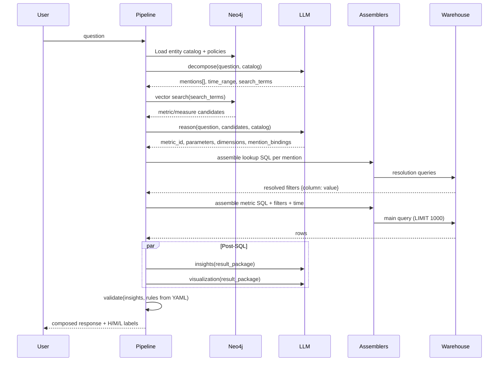

# Implementation Spec — Grounded Query Resolution & Rich Response Pipeline

**Status:** Spec (not yet implemented)  
**Branch target:** `cursor/semantic-layer-shell`  
**Owner:** Shobhit Tiwari  
**Depends on:** Phase 1–2 + dimension pipeline (complete)

**Related:** [Architecture](architecture.md) · [Setup](setup.md)

---

## 1. Purpose

Enable questions like:

> *"How much sales in Franklin Income Fund, Class A, last 2 weeks?"*

to produce **correct filtered SQL**, **full result context** (up to 1,000 rows), **structured insights**, **charts**, and **YAML-driven validation** with High / Medium / Low confidence labels — with **zero domain hardcoding** in application code.

### Goals

| # | Goal |
|---|---|
| G1 | Extract structured **mentions** (entity types, subtypes, time ranges, metric intent) from natural language |
| G2 | Resolve human-readable names to warehouse keys via **deterministic lookup SQL** (not YAML instance lists) |
| G3 | Assemble and execute **main metric SQL** with resolved filters + time predicates |
| G4 | Post-SQL: parallel **Insights** + **Visualization** agents on full rows (≤1,000) |
| G5 | **Validator** applies registry-defined rules; labels insight confidence |
| G6 | **Fully pluggable registry** — new domain = new YAML only |

### Non-goals (this spec)

- Agentic analytics (forecasting, anomaly detection, pattern mining) — deferred
- Multi-warehouse beyond Snowflake — Phase 3 architecture item
- Row-level security — Phase 3 architecture item
- Hierarchical entity ontology (Option B) — use **Option A: flat entity types**

---

## 2. Design principles

1. **Assembly, not generation.** Lookup SQL and metric SQL are assembled from graph templates. LLM selects from enumerated catalogs; it never authors JOINs, WHERE clauses, or aggregations.

2. **Graph defines plumbing; warehouse holds values.** Registry declares *which view* resolves *which entity type* and *which columns* are label vs key. Fund names, product names, and categories live in Snowflake — not in YAML instance files.

3. **Two-query pattern.** (1) Entity resolution SQL → IDs. (2) Metric SQL → facts. Both are deterministic and auditable.

4. **Catalog-driven LLM stages.** Decompose and Reason prompts are built at runtime from the published Neo4j graph (entity types, metrics, dimensions). No fund-specific strings in Python.

5. **Validation in registry.** Thresholds, sanity checks, and confidence downgrade rules are YAML. Code is a generic rule engine.

---

## 3. Option A — flat entity types

Each business concept is a **separate `entity` document** with its own id, synonyms, optional attribute vocabulary, and `resolves_via` block.

### Asset-management entity catalog (author in YAML)

| `metadata.id` | Display name | Example user phrases | Example attribute values |
|---|---|---|---|
| `firm` | Firm | "Franklin Templeton", "BlackRock" | — |
| `buying_unit` | Buying Unit | "BU-123", "Northeast region" | — |
| `vehicle` | Vehicle | "ETF", "mutual fund", "SMA" | ETF, SMA, MF, DCIO, 529 |
| `asset_class` | Asset Class | "equity", "fixed income" | Equity, Multi-Asset, Fixed Income, Growth |
| `product` | Product | "Franklin Income Fund", "Opportunity Trust" | — |
| `share_class` | Share Class | "Class A", "Advisory Class" | A, S, R, Advisory Class |
| `morningstar_category` | Morningstar Category | "Large Growth", "Large Value" | Large Value, Large Growth, Opportunity Trust |

Subtypes (Equity, Class A, ETF) are modeled as **`spec.attributes[]`** on the entity — used to constrain Reason/decompose, not as separate graph hierarchies.

---

## 4. Registry schema extensions

### 4.1 Extended `kind: entity`

```yaml
apiVersion: semantic-layer/v1
kind: entity
metadata:
  id: product
  name: "Product"
  description: "An investable product such as a mutual fund or ETF share class line."
  synonyms: [fund, portfolio, strategy]
  status: active

spec:
  # Optional — known subtype labels for this entity (Option A)
  attributes:
    - id: vehicle_type
      description: "Legal vehicle wrapper"
      values: [ETF, SMA, MF, DCIO, "529"]
    # Omit if entity has no enumerated subtypes

  # REQUIRED for filterable entities — how to resolve name → key via SQL
  resolves_via:
    data_source: dim_product              # ref → data_source.metadata.id
    label_column: product_name            # column users speak
    key_column: product_id                # column used in fact filters
    match: ilike                          # exact | ilike | prefix
    limit: 10                             # max candidates for disambiguation

  # Optional — narrow lookup when other entities already resolved
  # Keys are entity ids; values are column names on resolves_via.data_source
  correlate_with:
    share_class: share_class
    firm: firm_id

  # Optional — which fact columns this key filters (for assembler)
  filter_targets:
    - data_source: fct_fund_transactions
      column: product_id
    - data_source: fct_daily_fund_balances
      column: product_id
```

```yaml
apiVersion: semantic-layer/v1
kind: entity
metadata:
  id: share_class
  name: "Share Class"
  synonyms: [class, share class, advisory class]
spec:
  attributes:
    - id: class_code
      values: [A, S, R, "Advisory Class"]
  resolves_via:
    data_source: dim_product
    label_column: share_class
    key_column: share_class
    match: exact
  filter_targets:
    - data_source: fct_fund_transactions
      column: share_class
```

```yaml
apiVersion: semantic-layer/v1
kind: entity
metadata:
  id: morningstar_category
  name: "Morningstar Category"
  synonyms: [morningstar, category, style box]
spec:
  attributes:
    - id: category_name
      values: ["Large Value", "Large Growth", "Opportunity Trust"]
  resolves_via:
    data_source: dim_product
    label_column: morningstar_category
    key_column: morningstar_category
    match: ilike
```

**Rules:**

- `resolves_via.data_source` must reference an existing `data_source` with `type: dimension` (or bridge).
- `label_column` and `key_column` must exist on that data source's `schema_fields`.
- `filter_targets` must reference columns on data sources reachable from the metric's measures.
- Entities without `resolves_via` are **glossary-only** (used for discovery, not SQL filters).

### 4.2 New `kind: validation_policy`

```yaml
apiVersion: semantic-layer/v1
kind: validation_policy
metadata:
  id: net_flow_ratio_validation
  name: "Net Flow Ratio validation"
  description: "Post-query checks for net flow ratio answers."
  status: active

spec:
  applies_to:
    - kind: metric
      ref: net_flow_ratio

  # Global outcome when multiple rules fail
  confidence_aggregation: min   # min | weighted

  rules:
    - id: entity_resolved
      type: entity_resolution
      expect: exactly_one         # exactly_one | at_least_one | optional
      severity: high
      on_fail: downgrade_to_low
      message: "Could not uniquely identify the requested product or fund."

    - id: rows_returned
      type: row_count
      min: 1
      severity: high
      on_fail: downgrade_to_low
      message: "Query returned no rows for the given filters and date range."

    - id: time_coverage
      type: time_coverage
      min_days: 1
      severity: medium
      on_fail: downgrade_one_level
      message: "Result does not cover the requested time window."

    - id: ratio_range
      type: column_range
      column: metric_value
      min: 0
      max: 100
      severity: medium
      on_fail: downgrade_one_level
      message: "Ratio outside 0–100% — check denominator alignment."

    - id: sales_floor
      type: column_range
      column: total_amount
      min: 0
      severity: low
      on_fail: flag_only
      message: "Negative sales value detected."

    - id: business_rule_denominator
      type: expression
      # Safe DSL — no arbitrary SQL; see §8.4
      expression: "denominator != 0 OR metric_value IS NULL"
      severity: high
      on_fail: downgrade_to_low

    - id: domain_sanity
      type: llm_check
      enabled: false              # opt-in per policy
      prompt: "Single-fund sales over 2 weeks should be between $1K and $500M."
      severity: low
      on_fail: downgrade_one_level
```

**Supported rule types (v1 engine):**

| `type` | Inputs | Deterministic? |
|---|---|---|
| `entity_resolution` | Resolution stage output | Yes |
| `row_count` | `min`, `max` | Yes |
| `column_range` | `column`, `min`, `max` | Yes |
| `column_not_null` | `column` | Yes |
| `time_coverage` | `min_days`, `time_key` | Yes |
| `expression` | Safe DSL over row + context | Yes |
| `llm_check` | `prompt` | No (opt-in) |

### 4.3 Metric extension — link validation policy

```yaml
# On metric spec (optional — fallback to global default policy)
spec:
  validation_policy: net_flow_ratio_validation
```

If omitted, ingestor may attach a `default_validation` policy document.

### 4.4 Measure extension — time filter (existing, now wired)

```yaml
spec:
  time_filter:
    type: direct
    column: transaction_date
    alias: t
```

Assembler must inject `AND t.transaction_date BETWEEN :start AND :end` when a time range is resolved.

### 4.5 Column `entity_ref` (existing)

Keep linking fact/dim columns to entity ids for `REPRESENTS` edges and filter-target validation.

---

## 5. Neo4j graph schema changes

### 5.1 New / extended nodes

| Label | Key properties |
|---|---|
| `:Entity` | `id`, `name`, `description`, `definition_embedding`, `synonyms[]`, `attributes` (JSON), `resolves_via` (JSON), `filter_targets` (JSON) |
| `:ValidationPolicy` | `id`, `name`, `description`, `rules` (JSON), `confidence_aggregation` |

### 5.2 New relationships

| Relationship | Direction | Properties |
|---|---|---|
| `HAS_VALIDATION_POLICY` | `Metric → ValidationPolicy` | — |
| `RESOLVES_VIA` | `Entity → DataSource` | `label_column`, `key_column`, `match`, `limit` |
| `FILTERS_COLUMN` | `Entity → Column` | `data_source_id` |

Existing: `REPRESENTS` (`Column → Entity`), `HAS_COLUMN`, `JOINS_TO`, etc.

### 5.3 Indexes

```cypher
CREATE CONSTRAINT validation_policy_id IF NOT EXISTS
FOR (v:ValidationPolicy) REQUIRE v.id IS UNIQUE;

-- Optional future: entity value search
-- CREATE VECTOR INDEX entity_name_embedding IF NOT EXISTS ...
```

Entity discovery at query time uses the **entity catalog** (names, synonyms, attributes) — not per-instance embeddings in v1.

---

## 6. Query pipeline — full stage list

```
decompose → discover → reason → resolve_entities → resolve_time
  → resolve_metric → assemble → execute
  → analyze → [insights ∥ visualization] → validate → compose → done
```

### Stage diagram



---

## 7. Stage specifications

### 7.1 `decompose`

**Input:** `question`, `entity_catalog` (from graph)

**LLM output schema (`DecomposeResult` v2):**

```json
{
  "intent": "metric_query",
  "search_terms": ["sales", "franklin income fund"],
  "mentions": [
    {
      "text": "Franklin Income Fund",
      "entity_type": "product",
      "role": "filter",
      "confidence": 0.91
    },
    {
      "text": "Class A",
      "entity_type": "share_class",
      "role": "filter",
      "subtype": "A",
      "confidence": 0.88
    }
  ],
  "time_range": {
    "text": "last 2 weeks",
    "type": "relative"
  }
}
```

**Constraints:**

- `entity_type` must be in `entity_catalog[].id`
- `subtype` must be in `entity.attributes[].values` when provided
- `role`: `filter` | `dimension` | `ambiguous`
- Heuristic fallback: no domain strings — if LLM disabled, pass raw question as single `search_term` only

**NDJSON:** `stage_complete` only (no new event type).

---

### 7.2 `discover` (unchanged core)

Vector search on `Metric`, `Measure`, `DataSource` `description_embedding`.

Enrich candidates with `dimensions`, `synonyms`, `validation_policy` ref.

---

### 7.3 `reason`

**Input:** `question`, `candidates`, `entity_catalog`, `mentions`

**LLM output schema (`ReasonResult` v2):**

```json
{
  "metric_id": "total_sales",
  "parameters": { "basis": "gross" },
  "dimensions": [],
  "mention_bindings": [
    { "mention_index": 0, "entity_type": "product", "apply_as": "filter" },
    { "mention_index": 1, "entity_type": "share_class", "apply_as": "filter" }
  ],
  "confidence": 0.87,
  "rationale": "Sales question with product and share class filters."
}
```

**Confidence gate:** unchanged — pause if below threshold; emit `confirmation_required`.

---

### 7.4 `resolve_entities` (NEW)

**Input:** `mention_bindings`, `entity_catalog`, `graph`

**Per mention:**

1. Load `Entity.resolves_via` → `DataSource.location`, columns, `match` strategy
2. Apply `correlate_with` predicates from already-resolved filters
3. **Assemble lookup SQL** (deterministic template):

```sql
SELECT DISTINCT
  {key_column} AS resolved_key,
  {label_column} AS resolved_label
FROM {location_or_snapshot_cte}
WHERE {label_predicate}
  {correlation_predicates}
LIMIT {limit}
```

**Label predicates by `match`:**

| `match` | Predicate |
|---|---|
| `exact` | `{label_column} = :text` |
| `ilike` | `{label_column} ILIKE '%' || :text || '%'` |
| `prefix` | `{label_column} ILIKE :text || '%'` |

If `subtype` is set and maps to a column, add `AND {column} = :subtype`.

**Outcomes:**

| Match count | Action |
|---|---|
| 0 | `resolution_status: not_found` — continue; validator will fail `entity_resolution` rule |
| 1 | `resolution_status: resolved` → add to `filters[]` |
| >1 | `resolution_status: ambiguous` → emit `disambiguation_required` event; pause pipeline |

**Output (`EntityResolutionResult`):**

```json
{
  "resolutions": [
    {
      "mention_text": "Franklin Income Fund",
      "entity_type": "product",
      "status": "resolved",
      "key_column": "product_id",
      "key_value": "FIH-001",
      "label_value": "Franklin Income Fund",
      "lookup_sql_hash": "abc..."
    }
  ],
  "filters": [
    { "column": "product_id", "operator": "=", "value": "FIH-001", "source_entity": "product" },
    { "column": "share_class", "operator": "=", "value": "A", "source_entity": "share_class" }
  ],
  "resolution_sql": ["...", "..."]
}
```

**NDJSON events:**

```json
{"event": "entity_resolution", "resolutions": [...]}
{"event": "disambiguation_required", "entity_type": "product", "candidates": [...]}
```

---

### 7.5 `resolve_time` (NEW)

**Input:** `time_range` from decompose, `metric.time_key`, measure `time_filter`

**Resolver (deterministic Python; LLM only for ambiguous phrases):**

| Input | Output |
|---|---|
| `"last 2 weeks"` | `start = today - 14`, `end = today` |
| `"last month"` | previous calendar month |
| `"Q1 2025"` | `2025-01-01` .. `2025-03-31` |

**Output:**

```json
{
  "time_key": "transaction_date",
  "start": "2026-08-16",
  "end": "2026-08-30",
  "predicate": "t.transaction_date BETWEEN '2026-08-16' AND '2026-08-30'"
}
```

---

### 7.6 `resolve_metric` (existing)

Unchanged — exact subgraph fetch by `metric_id`.

---

### 7.7 `assemble` (extended)

**Inputs:** subgraph, `parameters`, `dimensions`, `filters[]`, `time_range`

**Inject into each measure CTE:**

1. Dimension columns (existing)
2. **Entity filters** — `AND alias.column = :value` for each filter whose column exists on measure's primary fact or joined dims
3. **Time predicate** — from `measure.time_filter.alias` + column

**Cache key** must include `filters` + `time_range` hash.

**NDJSON:** `sql_preview` includes `filters_applied`, `time_range_applied`, `resolution_sql`.

---

### 7.8 `execute`

```sql
-- appended to outer query or set via warehouse session
LIMIT 1000
```

**Config:** `MAX_RESULT_ROWS = 1000` (settings).

If Snowflake not configured: empty rows + warning (unchanged).

---

### 7.9 `analyze` (extended)

Existing `analyze_rows` — column profiles for all returned rows.

Output feeds Insights, Visualization, Validator.

---

### 7.10 `insights` (agent — structured output)

**Input:** `result_package` (full rows ≤1000, profiles, provenance, `business_rules`)

**Output schema:**

```json
{
  "headline": "Franklin Income Fund (Class A) had $12.4M in gross sales over the last 2 weeks.",
  "insights": [
    {
      "id": "ins-1",
      "text": "Total gross sales were $12.4M.",
      "evidence": {
        "type": "aggregation",
        "column": "total_amount",
        "function": "sum",
        "value": 12400000
      }
    }
  ],
  "follow_ups": ["Compare to prior 2 weeks", "Break down by share class"]
}
```

**LLM rules:** every numeric claim must include `evidence` referencing computable values from `rows` or `column_profiles`.

---

### 7.11 `visualization` (agent — structured output)

**Input:** same `result_package` + metric metadata

**Chart selection (hybrid):**

| Shape | Template id |
|---|---|
| time_key + 1 metric, >1 row | `line_temporal` |
| 1 dimension + 1 metric | `bar_categorical` |
| single row | `kpi_card` |
| 2 metrics | `grouped_bar` |

LLM picks `template_id` from enumerated list; Python fills Vega-Lite spec.

**Output:**

```json
{
  "charts": [
    {
      "id": "primary",
      "template_id": "line_temporal",
      "title": "Daily sales — Franklin Income Fund (Class A)",
      "library": "vega-lite",
      "spec": { "$schema": "...", "data": {"values": [...]}, "mark": "line", "encoding": {...} }
    }
  ],
  "recommended_chart_id": "primary"
}
```

---

### 7.12 `validate` (NEW — YAML-driven engine)

**Input:** `insights`, `charts`, `result_package`, `entity_resolutions`, `ValidationPolicy` from graph

**Process:**

1. Load policy for `metric_id`
2. Evaluate each rule deterministically
3. Map rule failures to `on_fail` actions
4. Label each insight `high` | `medium` | `low`
5. Compute `overall_confidence`

**Output:**

```json
{
  "overall_confidence": "medium",
  "rules_evaluated": 6,
  "rules_passed": 5,
  "findings": [
    {
      "rule_id": "ratio_range",
      "passed": false,
      "severity": "medium",
      "message": "Ratio 142% exceeds 100%."
    }
  ],
  "insight_labels": [
    { "insight_id": "ins-1", "confidence": "high", "reasons": ["row_count rule passed", "evidence cites sum(total_amount)"] }
  ]
}
```

**Confidence mapping:**

| Condition | Label |
|---|---|
| All `high` severity rules pass + evidence present | **high** |
| Any `medium` failure or partial evidence | **medium** |
| Any `high` failure or `entity_resolution` fail | **low** |

---

### 7.13 `compose` (NEW — replaces bare `answer` token)

Merge insights (labeled), charts, validation, table metadata into final payload.

Optional: short LLM **narrative wrapper** over structured payload only (no new numbers).

**NDJSON:**

```json
{"event": "response", "payload": { ... }}
{"event": "done", "result": { ... }}
```

---

## 8. Backend module layout

```
backend/app/
├── agents/
│   ├── nodes.py                 # extended pipeline orchestration
│   ├── decompose.py             # catalog-driven decompose
│   ├── dimension_selection.py   # existing
│   ├── entity_resolution.py     # NEW — lookup SQL assembler + executor
│   ├── time_resolution.py       # NEW — relative/absolute date parser
│   ├── insights.py              # structured insights agent
│   ├── visualization.py         # template-based viz agent
│   ├── validator.py             # NEW — YAML rule engine
│   └── response_composer.py     # NEW — final payload
├── sql_gen/
│   ├── assembler.py             # + filters + time injection
│   ├── lookup_assembler.py      # NEW — entity resolution SQL
│   └── dimension_resolver.py    # existing
├── registry/
│   ├── models.py                # + ValidationPolicy, EntitySpec
│   ├── validator.py             # + entity/validation policy checks
│   ├── ingestor.py              # + ValidationPolicy nodes
│   └── validation_rules.py      # NEW — rule type implementations
└── config/settings.py             # MAX_RESULT_ROWS, thresholds
```

---

## 8.4 Safe expression DSL (for `type: expression` rules)

No arbitrary SQL. Allowed operators:

```
column_ref | literal | NULL
comparison: = != < > <= >=
logical: AND OR NOT
functions: is_null(), is_not_null(), between()
context: row_count, entity_resolution_status, filter_count
```

Example: `denominator != 0 OR metric_value IS NULL`

---

## 9. API & NDJSON contract

### 9.1 Query request (extended)

```json
{
  "question": "How much sales in Franklin Income Fund, Class A, last 2 weeks?",
  "metric_id": null,
  "revision_hint": null,
  "disambiguation": {
    "entity_type": "product",
    "selected_key": "FIH-001"
  }
}
```

`disambiguation` resumes pipeline after `disambiguation_required`.

### 9.2 New / extended events

| Event | When |
|---|---|
| `entity_resolution` | After resolve_entities |
| `disambiguation_required` | Ambiguous lookup |
| `time_resolution` | After resolve_time |
| `response` | Final structured payload |
| `confirmation_required` | Low metric confidence (existing) |

### 9.3 Final `response` payload

```json
{
  "headline": "...",
  "insights": [
    { "id": "ins-1", "text": "...", "confidence": "high", "evidence": {...} }
  ],
  "charts": [{ "id": "primary", "spec": {...} }],
  "validation": {
    "overall_confidence": "medium",
    "findings": [...]
  },
  "data": {
    "columns": [...],
    "rows": [...],
    "row_count": 14,
    "truncated": false
  },
  "provenance": {
    "metric_id": "total_sales",
    "graph_version_id": "v-abc",
    "sql_hash": "...",
    "filters_applied": [...],
    "time_range_applied": {...},
    "entity_resolutions": [...]
  }
}
```

---

## 10. Frontend specification

### 10.1 New / updated components

| Component | Responsibility |
|---|---|
| `QueryConsole` | Disambiguation UI + confirmation UI |
| `EntityResolutionPanel` | Show what was resolved (name → id) |
| `InsightsPanel` | Headline + bullets with H/M/L badges |
| `ChartPanel` (new) | Render Vega-Lite via `react-vega` |
| `ValidationBanner` (new) | Overall confidence + findings |
| `ResultsPanel` | Table up to 1000 rows |

### 10.2 Dependencies

```json
"react-vega": "^7.x",
"vega-lite": "^5.x"
```

---

## 11. Hardcoding removal checklist

Remove or gate behind `DEBUG_FALLBACK` only:

| Location | Current hardcoding | Replacement |
|---|---|---|
| `llm/client.py` | `net_flow_ratio` default metric | Top discovery candidate or error |
| `llm/client.py` | `_infer_dimensions_from_question` fund/share_class | Graph-driven dimension inference |
| `graph/discovery.py` | Bundled `registry/` fallback in prod | Neo4j required; file fallback dev-only |
| `graph/resolver.py` | File fallback | Neo4j required in prod |
| `agents/dimension_selection.py` | File-based metric dimensions | Graph-only |
| Tests | Assert `net_flow_ratio` | Parameterized fixtures from sample registry |

**Production rule:** If Neo4j has no current graph version → fail fast with clear error, do not silently read bundled YAML.

---

## 12. Publish-time validation (registry)

Add to `validate_staged_registry`:

1. Every `entity.resolves_via.data_source` resolves
2. `label_column` / `key_column` exist on that data source
3. Every `filter_targets` column exists on declared data source
4. `validation_policy.applies_to` refs exist
5. Rule `column` refs exist in metric measure `output_columns` or known aliases
6. No duplicate `entity.metadata.id`
7. `attributes[].values` non-empty when `attributes` declared

---

## 13. Implementation phases & acceptance criteria

### Phase A — Entity catalog & decompose v2

**Files:** `models.py`, `ingestor.py`, `decompose.py`, `llm/client.py`, `entities/*.yaml`

| Acceptance test |
|---|
| Publish 7+ entity YAMLs (firm, product, share_class, …) |
| `GET /api/v1/graph/nodes/product` returns `resolves_via` |
| Decompose returns typed `mentions` for "Franklin Income Fund, Class A, last 2 weeks" |

---

### Phase B — SQL entity resolution

**Files:** `lookup_assembler.py`, `entity_resolution.py`, `nodes.py`

| Acceptance test |
|---|
| Resolution SQL generated without LLM |
| 1 match → `filters[]` populated |
| 0 match → `not_found` status |
| >1 match → `disambiguation_required` event |

---

### Phase C — Time resolution + filter assembly

**Files:** `time_resolution.py`, `assembler.py`

| Acceptance test |
|---|
| "last 2 weeks" → `BETWEEN` in SQL preview |
| `product_id` + `share_class` filters in assembled SQL |
| Cache key includes filters + time |

---

### Phase D — Full rows + Insights / Viz agents

**Files:** `insights.py`, `visualization.py`, `settings.py`, frontend `ChartPanel`

| Acceptance test |
|---|
| Agents receive up to 1000 rows |
| Insights return structured JSON with evidence |
| Chart renders in frontend for time-series result |

---

### Phase E — Validation policies + composer

**Files:** `validator.py`, `validation_rules.py`, `response_composer.py`, `validation_policies/*.yaml`

| Acceptance test |
|---|
| Failed `row_count` rule → overall confidence `low` |
| Insight badges match rule outcomes |
| Final `response` event contains all sections |

---

### Phase F — De-hardcode & pluggability

| Acceptance test |
|---|
| Grep codebase: no `net_flow_ratio` outside tests/registry |
| New metric YAML published → queryable without code change |
| Integration test with alternate sample registry folder |

---

## 14. Example end-to-end trace

**Question:** *"How much sales in Franklin Income Fund, Class A, last 2 weeks?"*

| Stage | Key output |
|---|---|
| decompose | `mentions: [product: Franklin Income Fund, share_class: A]`, `time_range: last 2 weeks` |
| discover | `total_sales` metric candidate (score 0.89) |
| reason | `metric_id: total_sales`, `basis: gross`, bindings for both mentions |
| resolve_entities | Lookup SQL on `dim_product` → `product_id=FIH-001`, `share_class=A` |
| resolve_time | `2026-08-16` .. `2026-08-30` |
| assemble | `WHERE product_id='FIH-001' AND share_class='A' AND transaction_date BETWEEN ...` |
| execute | 14 daily rows |
| insights | "Total gross sales $12.4M" with `evidence: sum(total_amount)` |
| visualization | Daily line chart |
| validate | `entity_resolved` pass, `rows_returned` pass → insight confidence `high` |
| compose | Full payload to frontend |

---

## 15. Open questions (defaults assumed in this spec)

| Question | Assumed default |
|---|---|
| Disambiguation UX | Pause pipeline; user picks from candidates; resume with `disambiguation` in request |
| `llm_check` validation rules | Disabled by default (`enabled: false`) |
| Resolution query warehouse | Same Snowflake connection as main query |
| Snapshot strategy on lookup dims | Use same `latest_snapshot` CTE logic as measure joins |

---

## 16. Document history

| Date | Change |
|---|---|
| 2026-08-30 | Initial spec — Option A flat entities, SQL resolution, validation policies, post-SQL agents |
